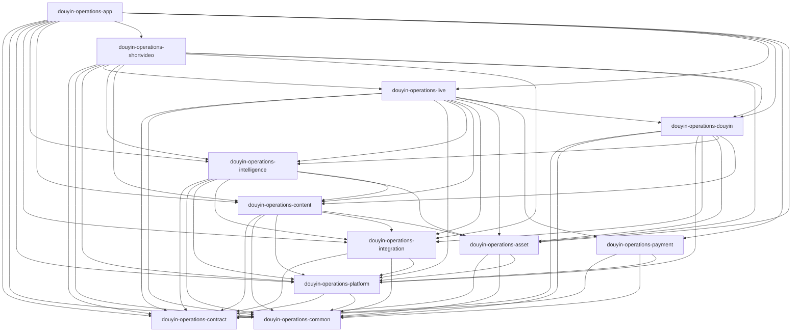

# dy05 构建说明（模块化单体）

**背景与文档政策**：见 **[SSOT.md](./SSOT.md)**、**[README.md](./README.md)**。

---

## 1. 目标与原则

| 项目 | 说明 |
|------|------|
| 部署形态 | **单个可执行 Jar**（`douyin-operations-app`） |
| 代码形态 | **多 Maven 子模块**（目标态），边界接近可选的微服务切分 |
| 依赖方向 | **有向无环**；禁止跨域直接访问他人 Repository |
| Flyway | **建议集中在 app 模块**；脚本可用前缀区分归属 |

**约定**：**经营 + AI** 合并为一个 Maven 模块 **`douyin-operations-intelligence`**（`module.ai`、`module.agent` 等）；**`module.product`（直播商品/话术）在 `douyin-operations-live`**。

---

## 2. 目标目录结构

```
dy05/
├── pom.xml                           # 父 POM：packaging=pom
├── douyin-operations-contract/       # 契约与跨域接口
├── douyin-operations-common/         # common 包主体
├── douyin-operations-platform/
├── douyin-operations-integration/
├── douyin-operations-asset/
├── douyin-operations-content/
├── douyin-operations-douyin/
├── douyin-operations-payment/
├── douyin-operations-live/
├── douyin-operations-shortvideo/
├── douyin-operations-intelligence/
├── douyin-operations-app/
├── front/
├── docker/
├── sql/
└── docs/                             # 仅 README / SSOT / BUILD + modules/ + adr/ + _archive/
```

**当前状态**：
- **P0**：根聚合 POM + **`douyin-operations-app`** 可执行模块与 Flyway。
- **P1～P4（已落地）**：**contract / common / platform / integration / asset / content / intelligence / douyin / payment / live / shortvideo** 均为独立 Maven 模块；业务实现按域分 JAR，**app** 依赖上述全部模块并打包为单进程。依赖 `auth` 等的 **`common` 桥接类**仍在 **common** 或 **platform**（如 `AuthTokenFilter`、`AuditLogAspect`、`WebMvcConfig` 等）。**`DouyinSharePasteParser`** 在 **`module.shortvideo.util`**。
- **后续**：integration 与鉴权进一步解耦、或新增独立 BFF，属演进项，非阻塞。

---

## 3. 模块依赖（Mermaid）



（**contract / common** 为各业务模块的基础依赖；图中已展开主要边，**live** 与 **shortvideo** 另依赖 **common** 等，与各自 `pom.xml` 一致。）

---

## 4. 环境与版本

| 项 | 版本 |
|----|------|
| JDK | 17 |
| Spring Boot | 3.3.7 |
| Maven | 3.9+ |
| 前端 | Node 18+，`front/` |

数据库与中间件：见 **`CLAUDE.md`**、`docker/docker-compose.yml`。

---

## 5. 构建命令（多模块落地后）

在仓库根：

```bash
mvn -q compile
mvn -q -pl douyin-operations-app -am package -DskipTests
mvn -pl douyin-operations-app -am spring-boot:run
mvn -q test
mvn -q verify
```

根目录 **`packaging=pom`** 未绑定 Spring Boot 插件，**不要**只执行裸的 `mvn spring-boot:run`（应带 **`-pl douyin-operations-app -am`**，或双击 **`run-app.cmd`**）。

---

## 6. 前端

```bash
cd front
npm ci
npm run type-check
npm run build
```

---

## 7. 迁移阶段

| 阶段 | 内容 |
|------|------|
| P0 | 父 POM + 单 `app` 含全部源码，`mvn verify` 与现网行为一致（**已完成**） |
| P1 | 抽出 integration或 asset（**进行中**：`douyin-operations-common` 已落地；integration 待解耦 `AuthTokenFilter`） |
| P2 | platform |
| P3 | intelligence |
| P4 | **`douyin-operations-douyin` / `douyin-operations-payment` / `douyin-operations-live` / `douyin-operations-shortvideo`** 已落地；`content` 已独立；**`module.payment`** 在 **payment** 子模块；**`module.benchmark`** 在 **`douyin-operations-shortvideo`**；**`module.product`** 在 **`douyin-operations-live`**；**GMV 对账**在 **`live`**；跨域 glue 以 **app** 与 **SSOT §4** 表为准；**集成测试**可留在 **app**（`@SpringBootTest` 指向主应用） |

**App 层 glue（保留在主应用，避免环依赖或基础设施集中）**：
- **`module/dashboard`**：经营驾驶舱聚合（Controller/Service/VO）
- **`module/auth`**：**`DashboardController`**（`authDashboardController`，与 `module.dashboard` 不同包）；**`SystemServiceImpl`**（`module/system`：健康检查、BOS/ES/Milvus 等）
- **`module/live`**：`LiveSessionShortVideoExportServiceImpl`、`LiveCompetitorMonitorBridgeController`（shortvideo）；**`LiveGmvReconciliationScheduler`** 在 **live** 子模块
- **`config/ElasticsearchConfig`、`config/MilvusConfig`**：全局搜索/向量客户端配置
- **`DouyinOAuthController`** 在 **`douyin`**；**`DouyinDataCollector`** 在 **live**；**`QueryRewriteServiceImpl`** 在 **`douyin`**；**`WorkflowExecutorImpl`** 在 **live**；**`CopyAiController`** 在 **shortvideo**；**`ViolationWordServiceImpl` / `LlmClientAiServiceImpl` / `MessagingWebhookHandlerImpl` / `TianApiMaterialImportServiceImpl`** 在 **intelligence**；**`module.common.service` 四类运维服务** 在 **platform**

---

## 8. 修订记录

| 日期 | 说明 |
|------|------|
| 2026-04-13 | 补充 `douyin`/`payment`/`live`/`shortvideo` 子模块与依赖图；GMV 对账调度在 live；app glue 更新 |
| 2026-04-13 | **`module.benchmark`** 迁入 **`douyin-operations-shortvideo`**（Milvus/Resilience4j/Cache 依赖随 shortvideo POM） |
| 2026-04-13 | **`module.product`** 迁入 **`douyin-operations-live`**；**`ProductSearchLlmTool`** 在 live（LLM 工具依赖 `ProductService`） |
| 2026-04-13 | **`slangdict`→live**，**`search`→shortvideo**；**douyinapi**：OAuth→**douyin**、采集器→**live**；**app/ai** 切片至 live/sv |
| 2026-04-13 | 与 dy05 文档收敛配套；注明当前仍以单模块代码为主 |
| 2026-04-13 | 文档对齐：依赖图补充 **contract/common** 与典型传递边；**App glue** 与 **SSOT §4** 表一致；P1～P4 状态更新 |
| 2026-04-13 | P0：父 POM + `douyin-operations-app` 承载全部源码 |
| 2026-04-13 | P1部分：`douyin-operations-common`；根目录会话/测试稿清理 |
