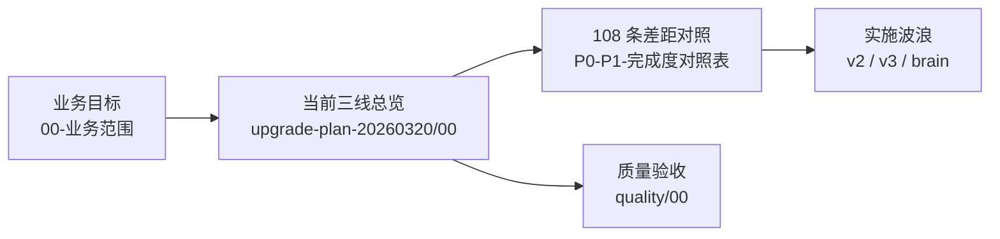

# 全仓库升级 · 单一总索引

> **用途**：一页定位所有「升级 / 规划 / 阶段验收 / 差距分析」类文档；与 [业务与架构 README](README.md)、[文档代码同步清单](development/04-文档代码同步清单.md) 配合使用。  
> **维护**：新增独立升级目录或总览时，请在本文件补一行；历史方案**保留链结**并标注**时效**。

---

## 一、推荐阅读顺序（执行层）

1. 产品边界与目标：[00-业务范围.md](00-业务范围.md)  
2. **三大核心能力**（大脑 / 直播 / 短视频）主方案：[upgrade-plan-20260320/00-三大核心能力升级总览.md](upgrade-plan-20260320/00-三大核心能力升级总览.md)  
3. **结构化完成度（§2 全优先级）**：[upgrade-plan-20260320/P0-P1-完成度对照表.md](upgrade-plan-20260320/P0-P1-完成度对照表.md)（P0+P1+P2，共 108 条）  
4. 对外验收与契约：[quality/00-对外验收口径与三层100%.md](quality/00-对外验收口径与三层100%.md)、[api/03-P0契约清单.md](api/03-P0契约清单.md)

---

## 二、按目录：升级方案套件（`docs/upgrade-plan-*`）

| 目录 | 定位 | 入口文档 |
|------|------|----------|
| **upgrade-plan-20260320** | **当前主线**：三大核心能力评估 + 8 周路线图 + **完成度对照表** | [00-三大核心能力升级总览](upgrade-plan-20260320/00-三大核心能力升级总览.md) |
| **upgrade-plan-20260411** | **最新 AI 全面升级主方案**：围绕行业大脑 / 短视频 / 直播三类专家系统，先修真实闭环，再做全面增强 | [00-AI-三大专家系统全面升级计划](upgrade-plan-20260411/00-AI-三大专家系统全面升级计划.md) |
| **upgrade-plan-v2** | **行业第一**总方案：Phase1–4、数据库迁移、Phase5 补全、**Phase6** 审计与 100% 覆盖 | [00-行业第一升级总方案](upgrade-plan-v2/00-行业第一升级总方案.md) |
| **upgrade-plan-v2/phase5** | Phase5 补全（P0/P1/P2 分包） | [00-Phase5-补全计划总览](upgrade-plan-v2/phase5/00-Phase5-补全计划总览.md) |
| **upgrade-plan-v2/phase6** | Phase6 全面审计、执行计划、验收 | [00-Phase6-全面审计与升级总览](upgrade-plan-v2/phase6/00-Phase6-全面审计与升级总览.md) |
| **upgrade-plan-v3** | 安全 / 性能 / 前端类型 / 测试可维护 | [00-升级总览](upgrade-plan-v3/00-升级总览.md) |
| **upgrade-plan-brain** | 「最强大脑」专题：贝叶斯、风格向量化、诊断、因果、执行清单 | [00-最强大脑升级方案总览](upgrade-plan-brain/00-最强大脑升级方案总览.md) |
| **upgrade-plan-20260316** | AI 进化模块专项（历史切片） | [07-AI进化模块全面升级方案](upgrade-plan-20260316/07-AI进化模块全面升级方案.md) |

### v2 常用子锚点（排期 / 对齐）

| 文档 | 说明 |
|------|------|
| [07-升级状态对齐清单](upgrade-plan-v2/07-升级状态对齐清单.md) | 多方案状态对齐 |
| [08-升级进度深度分析](upgrade-plan-v2/08-升级进度深度分析.md) | 进度复盘 |
| [05-数据库迁移清单](upgrade-plan-v2/05-数据库迁移清单.md) | DB 相关 |
| [06-验收标准](upgrade-plan-v2/06-验收标准.md) | Phase 级验收 |
| [phase6/05-全面升级执行计划-100覆盖](upgrade-plan-v2/phase6/05-全面升级执行计划-100覆盖.md) | 100% 覆盖叙事 |
| [phase6/26-Phase6-验收与缺口附录](upgrade-plan-v2/phase6/26-Phase6-验收与缺口附录.md) | 缺口附录 |

### 20260411 配套拆解

| 文档 | 说明 |
|------|------|
| [upgrade-plan-20260411/01-后端全面升级执行分解](upgrade-plan-20260411/01-后端全面升级执行分解.md) | 后端工作流、服务、事实层、工具层拆解 |
| [upgrade-plan-20260411/02-前端工作台全面升级分解](upgrade-plan-20260411/02-前端工作台全面升级分解.md) | AI / 直播 / 短视频工作台改造 |
| [upgrade-plan-20260411/03-数据库与数据治理升级分解](upgrade-plan-20260411/03-数据库与数据治理升级分解.md) | 事实层、证据层、回流层、实验层数据设计 |
| [upgrade-plan-20260411/04-基础设施可观测与发布升级分解](upgrade-plan-20260411/04-基础设施可观测与发布升级分解.md) | 配额、监控、灰度、发布、成本治理 |
| [upgrade-plan-20260411/05-WBS-任务排期与验收矩阵](upgrade-plan-20260411/05-WBS-任务排期与验收矩阵.md) | 12 周排期、门禁、风险矩阵 |
| [upgrade-plan-20260411/06-当前落地进度-20260412](upgrade-plan-20260411/06-当前落地进度-20260412.md) | 2026-04-12 代码落地快照：已完成项、验证记录、剩余硬伤 |

---

## 三、深度分析 · 与 v2 互补（`docs/analysis/`）

| 文档 | 主题 |
|------|------|
| [二次全面升级-深度分析-迭代一](analysis/二次全面升级-深度分析-迭代一.md) | 事实复核 · 差距表 · Wave 规划 |
| [二次全面升级-深度分析-迭代二](analysis/二次全面升级-深度分析-迭代二.md) | 白名单 · 监控 · 孤儿页等 |
| [商品库模块-深度分析与升级建议](analysis/商品库模块-深度分析与升级建议.md) | 商品库 |
| [产品库话术-深度分析与升级建议](analysis/产品库话术-深度分析与升级建议.md) / [P0-P4 执行计划](analysis/产品库话术-P0-P4-执行计划.md) | 产品话术 |

---

## 四、模块内升级计划（`docs/modules/`）

> 属于**单模块**演进，未全部汇入 20260320 三线总表；实施时与 [P0-P1-完成度对照表](upgrade-plan-20260320/P0-P1-完成度对照表.md) 交叉核对避免重复立项。

| 路径 | 主题 |
|------|------|
| [live/2小时聊天式-方案深度分析与升级建议.md](modules/live/2小时聊天式-方案深度分析与升级建议.md) | 聊天式直播 |
| [live/2小时聊天式直播话术-升级计划.md](modules/live/2小时聊天式直播话术-升级计划.md) | 同上 · 计划 |
| [live/2小时聊天式-补充升级计划.md](modules/live/2小时聊天式-补充升级计划.md) | 补充 |
| [live/李阳阳-2小时拉自然流-全量升级计划.md](modules/live/李阳阳-2小时拉自然流-全量升级计划.md) | 拉自然流 |
| [live/李阳阳-2小时拉自然流带货-深度分析与升级建议.md](modules/live/李阳阳-2小时拉自然流带货-深度分析与升级建议.md) | 深度分析 |
| [live/话术生成与微调升级计划.md](modules/live/话术生成与微调升级计划.md) | 生成与微调 |

---

## 五、战略与商业（`docs/strategic/`）

| 文档 | 说明 |
|------|------|
| [护肤品赛道GMV分析-系统融合建议](strategic/护肤品赛道GMV分析-系统融合建议.md) | GMV 与系统能力映射 |

---

## 六、验收 / 契约 / CI（与「升级完成」判据相关）

| 文档 | 说明 |
|------|------|
| [quality/00-对外验收口径与三层100%.md](quality/00-对外验收口径与三层100%.md) | 契约 / 覆盖 / ゴールデンパス |
| [api/00-接口规范.md](api/00-接口规范.md) | 统一 POST、SSE 等 |
| [api/03-P0契约清单.md](api/03-P0契约清单.md) | P0 契约 JSON |
| [development/04-文档代码同步清单.md](development/04-文档代码同步清单.md) | 升级后必同步项 |
| [deployment/01-CI-CD.md](deployment/01-CI-CD.md) | 流水线与质量门槛 |

---

## 七、本索引不覆盖的范围

| 类型 | 说明 |
|------|------|
| **历史备份** | `docs-backup/`（见 [README 关于旧文档](README.md)） |
| **仅代码** | 未形成 MD 的改动见 Git / PR；重大变更应补 **Flyway** + **04 清单** |
| **ADR** | 架构决策见 [adr/](adr/)，与升级方案互补而非替代 |

---

## 八、变更记录

| 日期 | 说明 |
|------|------|
| 2026-03-20 | 初版：汇总 `upgrade-plan-*`、`analysis/`、`modules/live` 升级类文档及验收链接 |
| 2026-03-21 | **第二轮**：`upgrade-plan-20260320/P0-P1-完成度对照表.md` 与主仓库代码再对齐（03 日历/素材/看板/批任务等）；总览 [00-三大核心能力升级总览](upgrade-plan-20260320/00-三大核心能力升级总览.md) 增加「下一轮执行焦点」 |
| 2026-04-11 | 新增 [upgrade-plan-20260411/00-AI-三大专家系统全面升级计划.md](upgrade-plan-20260411/00-AI-三大专家系统全面升级计划.md)，作为面向 AI 三类专家系统的最新主方案 |
| 2026-04-12 | 新增 [upgrade-plan-20260411/06-当前落地进度-20260412.md](upgrade-plan-20260411/06-当前落地进度-20260412.md)，记录本轮 Phase 0/1 代码落地进度与验证结果 |
