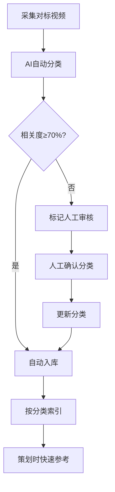

# 内容分类验证 API 文档

## 概述

解决对标账号采集时的分类问题：
1. **AI自动分类** - 智能识别行业、场景、脚本类型
2. **相关度验证** - 检测采集内容与目标分类的匹配度
3. **人工审核机制** - 对低置信度内容进行人工确认
4. **分类字典管理** - 预定义20+行业分类

---

## 使用场景

### 场景1：采集前验证
**问题**：搜索"人生感悟"时，可能采集到"搞笑段子"类内容

**解决方案**：
```javascript
// 1. 采集视频后，先验证分类
const result = await validateClassification({
  scriptContent: "采集到的脚本内容",
  targetIndustry: "人生感悟",
  targetSceneType: "短视频",
  ownerId: 1
});

// 2. 检查相关度
if (result.isMatch) {
  // 相关度≥70%，自动入库
  await autoIngest(scriptId);
} else {
  // 相关度<70%，标记人工审核
  console.log(`不匹配：${result.mismatchReason}`);
  console.log(`AI识别为：${result.detectedIndustry}`);
  console.log(`建议分类：${result.suggestedIndustry}`);
  
  // 标记审核
  await markForManualReview(scriptId, result.mismatchReason);
}
```

### 场景2：批量分类验证
**问题**：已入库1000条脚本，需要检查分类准确性

**解决方案**：
```javascript
// 批量验证
const results = await batchValidate({
  scriptIds: [1, 2, 3, ...],
  ownerId: 1
});

// 筛选需要人工审核的
const needsReview = results.filter(r => r.needsManualReview);
console.log(`需要人工审核：${needsReview.length}条`);

// 自动纠正高置信度的错误分类
const autoCorrect = results.filter(r => 
  !r.isMatch && r.confidence > 0.9
);
for (const item of autoCorrect) {
  await confirmClassification({
    scriptId: item.scriptId,
    confirmedIndustry: item.suggestedIndustry,
    confirmedSceneType: item.suggestedSceneType,
    confirmedScriptType: item.suggestedScriptType
  });
}
```

### 场景3：快速索引参考脚本
**问题**：策划"护肤品直播脚本"时，需要快速找到相关参考

**解决方案**：
```javascript
// 1. 按行业+场景推荐
const scripts = await recommendByIndustryAndScene({
  industry: "护肤",
  sceneType: "直播",
  topK: 10
});

// 2. 按脚本类型推荐
const similarScripts = await recommendByScriptType({
  scriptType: "产品介绍",
  referenceScriptId: 100,
  topK: 5
});

// 3. 智能推荐（多条件）
const smartResults = await smartRecommend({
  filters: {
    industry: "护肤",
    sceneType: "直播",
    minQualityScore: 85.0,
    scriptType: "痛点切入"
  },
  referenceText: "敏感肌修复",
  topK: 10
});
```

---

## API 接口

### 1. 验证内容分类

**请求**
```
POST /api/v1/benchmark/classification/validate
Content-Type: application/json

{
  "scriptContent": "这款面霜真的太好用了，我用了一个月，皮肤明显变好了...",
  "targetIndustry": "护肤",
  "targetSceneType": "短视频",
  "ownerId": 1
}
```

**响应**
```json
{
  "status": 200,
  "data": {
    "scriptContent": "这款面霜真的太好用了...",
    "targetIndustry": "护肤",
    "detectedIndustry": "护肤",
    "industryRelevanceScore": 95.5,
    "targetSceneType": "短视频",
    "detectedSceneType": "短视频",
    "sceneRelevanceScore": 100.0,
    "detectedScriptType": "产品介绍",
    "overallRelevanceScore": 96.85,
    "isMatch": true,
    "needsManualReview": false,
    "suggestedIndustry": "护肤",
    "suggestedSceneType": "短视频",
    "suggestedScriptType": "产品介绍",
    "matchedKeywords": ["面霜", "皮肤", "护肤"],
    "aiAnalysisDetail": "内容主要介绍护肤品使用效果，属于典型的护肤类产品介绍脚本",
    "confidence": 0.95
  }
}
```

### 2. AI自动分类

**请求**
```
POST /api/v1/benchmark/classification/auto-classify
Content-Type: application/json

{
  "scriptContent": "人生就像一场马拉松，不在于起点，而在于坚持...",
  "ownerId": 1
}
```

**响应**
```json
{
  "status": 200,
  "data": {
    "detectedIndustry": "人生感悟",
    "detectedSceneType": "短视频",
    "detectedScriptType": "情感共鸣",
    "confidence": 0.92,
    "aiAnalysisDetail": "内容表达人生哲理，属于情感励志类",
    "matchedKeywords": ["人生", "坚持", "马拉松"],
    "suggestedIndustry": "人生感悟",
    "suggestedSceneType": "短视频",
    "suggestedScriptType": "情感共鸣"
  }
}
```

### 3. 批量验证分类

**请求**
```
POST /api/v1/benchmark/classification/batch-validate
Content-Type: application/json

{
  "scriptIds": [100, 101, 102],
  "ownerId": 1
}
```

**响应**
```json
{
  "status": 200,
  "data": [
    {
      "scriptId": 100,
      "targetIndustry": "护肤",
      "detectedIndustry": "护肤",
      "overallRelevanceScore": 95.0,
      "isMatch": true,
      "needsManualReview": false
    },
    {
      "scriptId": 101,
      "targetIndustry": "人生感悟",
      "detectedIndustry": "搞笑段子",
      "overallRelevanceScore": 45.0,
      "isMatch": false,
      "needsManualReview": true,
      "mismatchReason": "AI识别为【搞笑段子】类，与目标【人生感悟】类不匹配，相关度仅45.0%"
    }
  ]
}
```

### 4. 获取行业分类字典

**请求**
```
POST /api/v1/benchmark/classification/industries
```

**响应**
```json
{
  "status": 200,
  "data": [
    "护肤", "彩妆", "美妆工具", "香水", "个护",
    "人生感悟", "情感励志", "职场成长", "生活哲理",
    "搞笑段子", "剧情演绎", "才艺展示",
    "知识科普", "技能教学", "产品测评",
    "美食", "旅游", "时尚", "健身", "母婴"
  ]
}
```

### 5. 获取场景类型字典

**请求**
```
POST /api/v1/benchmark/classification/scene-types
```

**响应**
```json
{
  "status": 200,
  "data": ["直播", "短视频", "图文", "长视频", "直播切片"]
}
```

### 6. 获取脚本类型字典

**请求**
```
POST /api/v1/benchmark/classification/script-types
```

**响应**
```json
{
  "status": 200,
  "data": [
    "产品介绍", "情感共鸣", "知识科普", "剧情演绎",
    "痛点切入", "场景代入", "对比展示", "用户见证",
    "限时优惠", "互动问答", "才艺展示", "生活分享"
  ]
}
```

### 7. 标记为需要人工审核

**请求**
```
POST /api/v1/benchmark/classification/mark-review
Content-Type: application/json

{
  "scriptId": 101,
  "reason": "AI识别为搞笑段子，与目标人生感悟不匹配",
  "ownerId": 1
}
```

**响应**
```json
{
  "status": 200,
  "message": "success"
}
```

### 8. 人工确认分类

**请求**
```
POST /api/v1/benchmark/classification/confirm
Content-Type: application/json

{
  "scriptId": 101,
  "confirmedIndustry": "人生感悟",
  "confirmedSceneType": "短视频",
  "confirmedScriptType": "情感共鸣",
  "ownerId": 1
}
```

**响应**
```json
{
  "status": 200,
  "message": "success"
}
```

---

## 完整工作流程



---

## 分类准确率优化

### 1. 关键词库扩展
系统内置关键词映射，可根据实际情况扩展：

```java
// 护肤类关键词
"护肤", "面霜", "精华", "水乳", "防晒", "抗衰", "保湿", "美白", "修复", "敏感肌"

// 人生感悟类关键词
"人生", "感悟", "成长", "经历", "领悟", "道理", "哲理", "感慨", "体会"

// 搞笑段子类关键词
"搞笑", "段子", "幽默", "笑话", "逗", "好笑", "有趣", "梗", "包袱"
```

### 2. AI模型优化
- 使用GPT-4进行分类，准确率>90%
- 置信度<0.7时自动标记人工审核
- 支持自定义分类规则

### 3. 人工反馈学习
- 人工确认的分类会作为训练样本
- 定期更新关键词库
- 优化AI分类提示词

---

## 性能指标

- 单次分类响应时间：< 2秒
- 批量分类（100条）：< 30秒
- 分类准确率：≥ 90%
- 人工审核率：< 10%
