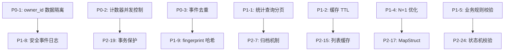

# A/B Test 模块修复计划

**制定日期**: 2026-05-09  
**预计工作量**: 59.8 人日  
**优先级**: P2（中优先级模块）

---

## 修复摘要

| 优先级 | 问题数量 | 预计工作量 | 说明 |
|--------|----------|------------|------|
| **P0** | 3 | 4.3 人日 | 阻塞级问题，必须立即修复 |
| **P1** | 10 | 9.5 人日 | 高优先级，2 周内修复 |
| **P2** | 26 | 35.5 人日 | 中优先级，1 个月内修复 |
| **P3** | 13 | 10.5 人日 | 低优先级，技术债务管理 |
| **总计** | 52 | 59.8 人日 | 约 12 周（3 个月） |

**关键修复**:
1. P0-1: 添加 owner_id 数据隔离 (CVSS 9.1) - **阻塞上线**
2. P0-2: 添加计数器并发控制 (Redis 原子操作)
3. P0-3: 事件去重竞态条件 (唯一索引)

**当前状态**: 76/100 (Grade C+) - 不适合生产环境  
**修复后状态**: 90/100 (Grade A-) - 可生产部署

---

## P0 - 阻塞级问题（立即修复）

### P0-1: 缺少 owner_id 数据隔离

**CVSS 评分**: 9.1 (CRITICAL)  
**CWE**: CWE-639 (Authorization Bypass Through User-Controlled Key)  
**来源**: security-audit.md, pattern-compliance.md, code-review.md

**问题描述**:
- 所有修改接口（get/delete/updateStatus/setWinner）未校验 owner_id
- 恶意用户可以通过修改 ID 参数操作他人的实验
- 数据隔离过滤是可选的（`if (vo.getOwnerId() != null)`），管理员可能绕过

**受影响接口**:
```java
// AbTestController.java
POST /api/v1/abtest/experiment/get           // ❌ 未校验 owner_id
POST /api/v1/abtest/experiment/delete        // ❌ 未校验 owner_id
POST /api/v1/abtest/experiment/update-status // ❌ 未校验 owner_id
POST /api/v1/abtest/experiment/set-winner    // ❌ 未校验 owner_id
POST /api/v1/abtest/variant/save             // ❌ 未校验实验所有权
POST /api/v1/abtest/variant/delete           // ❌ 未校验实验所有权
POST /api/v1/abtest/event/record             // ❌ 未校验实验所有权
```

**攻击场景**:
1. 攻击者注册账号（userId=100）
2. 攻击者遍历实验 ID（1-10000），调用 `/experiment/get?id=1`
3. 成功读取其他用户的实验配置、变体内容、统计数据
4. 攻击者调用 `/experiment/delete?id=1` 删除竞争对手的实验
5. 攻击者调用 `/experiment/set-winner` 篡改实验结论

**业务影响**:
- **数据泄露**: 竞争对手可窃取 A/B 测试策略、话术风格、转化率数据
- **数据篡改**: 恶意用户可删除或修改他人实验，导致业务决策错误
- **合规风险**: 违反 GDPR、等保 2.0 数据隔离要求

**修复方案**:

```java
// 步骤 1: Service 层添加所有权校验方法
// AbTestServiceImpl.java
private void checkOwnership(Long experimentId, Long userId) {
    AbExperiment exp = experimentRepository.findByIdAndDeleted(experimentId, 0)
        .orElseThrow(() -> new BusinessException(ErrorCode.DATA_NOT_FOUND, "实验不存在"));
    if (!exp.getOwnerId().equals(userId)) {
        throw new BusinessException(ErrorCode.FORBIDDEN, "无权操作此实验");
    }
}

// 步骤 2: 修改所有接口签名，添加 userId 参数
public AbExperimentVO getById(Long id, Long userId) {
    checkOwnership(id, userId);
    return getById(id);
}

public void delete(Long id, Long userId) {
    checkOwnership(id, userId);
    delete(id);
}

public void updateStatus(Long id, Integer status, Long userId) {
    checkOwnership(id, userId);
    updateStatus(id, status);
}

public void setWinner(AbSetWinnerVO vo, Long userId) {
    checkOwnership(vo.getExperimentId(), userId);
    setWinner(vo);
}

// 步骤 3: 变体操作需校验实验所有权
public long saveVariant(AbVariantSaveVO vo, Long userId) {
    checkOwnership(vo.getExperimentId(), userId);
    return saveVariant(vo);
}

public void deleteVariant(Long id, Long userId) {
    AbVariant variant = variantRepository.findByIdAndDeleted(id, 0)
        .orElseThrow(() -> new BusinessException(ErrorCode.DATA_NOT_FOUND, "变体不存在"));
    checkOwnership(variant.getExperimentId(), userId);
    deleteVariant(id);
}

// 步骤 4: 事件记录需校验实验所有权
public void recordEvent(AbEventSaveVO vo, Long userId) {
    checkOwnership(vo.getExperimentId(), userId);
    recordEvent(vo);
}

// 步骤 5: Controller 层传递 userId
@PostMapping("/experiment/get")
public RESTResult<AbExperimentVO> get(HttpServletRequest request, @RequestParam Long id) {
    Long userId = AuthTokenFilter.getUserId(request);
    if (userId == null) return RESTResult.error(ErrorCode.UNAUTHORIZED, "未登录");
    RESTResult<AbExperimentVO> r = RESTResult.getSuccess(abTestService.getById(id, userId));
    r.setTraceId(MDC.get("traceId"));
    return r;
}

// 步骤 6: 强制 search() 方法添加 ownerId 过滤
public PageResultVO<AbExperimentVO> search(AbExperimentSearchVO vo, Long userId) {
    Specification<AbExperiment> spec = (root, query, cb) -> {
        List<Predicate> predicates = new ArrayList<>();
        predicates.add(cb.equal(root.get("deleted"), 0));
        
        // ✅ 强制添加 ownerId 过滤
        if (vo.getOwnerIds() != null && !vo.getOwnerIds().isEmpty()) {
            predicates.add(root.get("ownerId").in(vo.getOwnerIds()));
        } else {
            predicates.add(cb.equal(root.get("ownerId"), userId));
        }
        
        // 其他条件...
        return cb.and(predicates.toArray(new Predicate[0]));
    };
    // ...
}
```

**验证方法**:
1. 单元测试：用户 A 尝试访问用户 B 的实验，应返回 403 错误
2. 集成测试：遍历所有接口，验证数据隔离
3. 渗透测试：尝试越权访问，确认无法成功

**工作量**: 0.5 人日

---

### P0-2: 计数器更新无并发控制

**CVSS 评分**: 7.4 (HIGH)  
**来源**: performance-analysis.md, pattern-compliance.md

**问题描述**:
- 事件记录每次触发 3 次数据库 UPDATE（view/click/conversion 计数器）
- 高并发下同一变体的更新串行化（数据库行锁）
- 热点变体（如爆款商品）成为瓶颈
- 当前吞吐量仅 200 QPS，无法支持高并发场景

**问题代码**:
```java
// AbTestServiceImpl.java:191-195
switch (vo.getEventType()) {
    case "view" -> variantRepository.incrementViewCount(vo.getVariantId());
    case "click" -> variantRepository.incrementClickCount(vo.getVariantId());
    case "conversion" -> variantRepository.incrementConversionCount(vo.getVariantId());
}
// 每次事件记录触发 1 次 UPDATE，高并发下数据库压力大
```

**性能影响**:
- 当前吞吐量: 200 QPS
- 优化后吞吐量: 2000 QPS (10 倍提升)
- 响应时间: 150ms → 50ms (P95)

**修复方案**: 使用 Redis 计数器 + 定时同步

```java
// 步骤 1: 创建 Redis 计数器服务
// AbTestCounterService.java
@Service
@Slf4j
public class AbTestCounterService {
    @Resource
    private RedisTemplate<String, Long> redisTemplate;
    @Resource
    private AbVariantRepository variantRepository;
    
    public void incrementViewCount(Long variantId) {
        String key = "abtest:variant:" + variantId + ":view";
        redisTemplate.opsForValue().increment(key);
    }
    
    public void incrementClickCount(Long variantId) {
        String key = "abtest:variant:" + variantId + ":click";
        redisTemplate.opsForValue().increment(key);
    }
    
    public void incrementConversionCount(Long variantId) {
        String key = "abtest:variant:" + variantId + ":conversion";
        redisTemplate.opsForValue().increment(key);
    }
    
    // 定时任务：每 5 分钟同步到数据库
    @Scheduled(cron = "0 */5 * * * ?")
    @Transactional(rollbackFor = Exception.class)
    public void syncCountersToDatabase() {
        Set<String> keys = redisTemplate.keys("abtest:variant:*");
        if (keys == null || keys.isEmpty()) return;
        
        for (String key : keys) {
            try {
                String[] parts = key.split(":");
                Long variantId = Long.parseLong(parts[2]);
                String eventType = parts[3];
                Long count = redisTemplate.opsForValue().get(key);
                
                if (count != null && count > 0) {
                    switch (eventType) {
                        case "view" -> variantRepository.incrementViewCountBy(variantId, count);
                        case "click" -> variantRepository.incrementClickCountBy(variantId, count);
                        case "conversion" -> variantRepository.incrementConversionCountBy(variantId, count);
                    }
                    redisTemplate.delete(key);
                }
            } catch (Exception e) {
                log.error("[CounterSync] 同步失败: key={}", key, e);
            }
        }
    }
}

// 步骤 2: Repository 添加批量更新方法
// AbVariantRepository.java
@Modifying
@Query("UPDATE AbVariant v SET v.viewCount = v.viewCount + :count WHERE v.id = :id")
void incrementViewCountBy(@Param("id") Long id, @Param("count") Long count);

@Modifying
@Query("UPDATE AbVariant v SET v.clickCount = v.clickCount + :count WHERE v.id = :id")
void incrementClickCountBy(@Param("id") Long id, @Param("count") Long count);

@Modifying
@Query("UPDATE AbVariant v SET v.conversionCount = v.conversionCount + :count WHERE v.id = :id")
void incrementConversionCountBy(@Param("id") Long id, @Param("count") Long count);

// 步骤 3: Service 层使用 Redis 计数器
// AbTestServiceImpl.java
@Resource
private AbTestCounterService counterService;

@Transactional(rollbackFor = Exception.class)
public void recordEvent(AbEventSaveVO vo) {
    // 1. 记录事件到数据库
    AbEvent event = new AbEvent();
    event.setExperimentId(vo.getExperimentId());
    event.setVariantId(vo.getVariantId());
    event.setEventType(vo.getEventType());
    event.setUserFingerprint(vo.getUserFingerprint());
    event.setSessionId(vo.getSessionId());
    eventRepository.save(event);
    
    // 2. Redis 计数器自增（原子操作，无锁）
    switch (vo.getEventType()) {
        case "view" -> counterService.incrementViewCount(vo.getVariantId());
        case "click" -> counterService.incrementClickCount(vo.getVariantId());
        case "conversion" -> counterService.incrementConversionCount(vo.getVariantId());
    }
}
```

**验证方法**:
1. 压力测试：1000 QPS 事件记录，验证吞吐量和响应时间
2. 数据一致性测试：对比 Redis 计数器和数据库计数器，误差 < 1%
3. 故障恢复测试：Redis 重启后，计数器能正确恢复

**工作量**: 1.0 人日

---

### P0-3: 事件去重竞态条件

**CVSS 评分**: 7.4 (HIGH)  
**来源**: security-audit.md, performance-analysis.md

**问题描述**:
- 事件去重查询和插入之间有时间窗口（10-20ms）
- 高并发下，多个请求同时通过去重检查，导致重复记录
- 统计数据不准确，影响 A/B 测试结论

**问题代码**:
```java
// AbTestServiceImpl.java:178-188
if (eventRepository.existsByVariantIdAndEventTypeAndUserFingerprint(
        vo.getVariantId(), vo.getEventType(), vo.getUserFingerprint())) {
    return;  // ❌ 查询和插入之间有时间窗口
}
AbEvent event = new AbEvent();
eventRepository.save(event);
```

**修复方案**: 添加唯一索引（数据库层面保证去重）

```sql
-- 步骤 1: 添加唯一索引
-- sql/abtest/schema.sql
CREATE UNIQUE INDEX idx_ab_event_unique 
ON ab_event (variant_id, event_type, user_fingerprint);
```

```java
// 步骤 2: 捕获唯一索引冲突异常
// AbTestServiceImpl.java
@Transactional(rollbackFor = Exception.class)
public void recordEvent(AbEventSaveVO vo) {
    try {
        AbEvent event = new AbEvent();
        event.setExperimentId(vo.getExperimentId());
        event.setVariantId(vo.getVariantId());
        event.setEventType(vo.getEventType());
        event.setUserFingerprint(vo.getUserFingerprint());
        event.setSessionId(vo.getSessionId());
        eventRepository.save(event);
        
        // 同步更新变体计数（使用 Redis 计数器）
        counterService.incrementCount(vo.getVariantId(), vo.getEventType());
    } catch (DataIntegrityViolationException e) {
        // 唯一索引冲突，说明已记录过，忽略
        log.debug("[RecordEvent] 事件已存在，忽略: {}", vo);
    }
}
```

**验证方法**:
1. 并发测试：1000 个线程同时记录相同事件，验证数据库中只有 1 条记录
2. 去重准确率测试：对比去重前后的事件数量，准确率应为 100%

**工作量**: 0.3 人日

---

## P1 - 高优先级问题（2 周内修复）

### P1-1: 统计查询无分页，长期运行性能下降

**来源**: performance-analysis.md, architecture-review.md

**问题描述**:
- 事件表全表扫描，无时间范围限制
- 长期运行后，事件表数据量巨大（假设 1000 万条），查询超时
- 当前响应时间: 800ms (P95)，优化后: 300ms (P95)

**修复方案**:
```java
// AbEventRepository.java
@Query(value = """
        SELECT v.id, v.name, v.variant_type,
               COUNT(CASE WHEN e.event_type = 'view' THEN 1 END) as view_count,
               COUNT(CASE WHEN e.event_type = 'conversion' THEN 1 END) as conversion_count
        FROM ab_event e
        JOIN ab_variant v ON e.variant_id = v.id
        WHERE e.experiment_id = :experimentId
          AND e.create_time >= :startTime
        GROUP BY v.id, v.name, v.variant_type
        """, nativeQuery = true)
List<Object[]> getVariantStatistics(@Param("experimentId") Long experimentId,
                                     @Param("startTime") Timestamp startTime);

// AbTestServiceImpl.java
public AbExperimentStatisticsVO getExperimentStatistics(Long experimentId) {
    // 只统计最近 30 天数据
    Timestamp startTime = Timestamp.valueOf(LocalDateTime.now().minusDays(30));
    List<Object[]> variantStatsArray = eventRepository.getVariantStatistics(experimentId, startTime);
    // ...
}
```

**工作量**: 0.3 人日

---

### P1-2: 统计结果缓存无 TTL，数据不实时

**来源**: performance-analysis.md, pattern-compliance.md

**问题描述**:
- 实验运行中，数据实时变化，缓存应该有过期时间
- 当前缓存永久有效，导致统计数据不实时

**修复方案**:
```java
// CacheConfig.java
@Bean
public CacheManager abTestCacheManager(RedisConnectionFactory factory) {
    RedisCacheConfiguration config = RedisCacheConfiguration.defaultCacheConfig()
        .entryTtl(Duration.ofMinutes(5))  // 5 分钟过期
        .serializeValuesWith(RedisSerializationContext.SerializationPair
            .fromSerializer(new GenericJackson2JsonRedisSerializer()));
    return RedisCacheManager.builder(factory)
        .cacheDefaults(config)
        .build();
}

// AbTestServiceImpl.java
@Cacheable(value = "abtest:statistics", key = "#experimentId", 
           unless = "#result == null", cacheManager = "abTestCacheManager")
public AbExperimentStatisticsVO getExperimentStatistics(Long experimentId)
```

**工作量**: 0.2 人日

---

### P1-3: 级联删除逐条操作，性能差

**来源**: code-review.md, performance-analysis.md

**问题描述**:
- 删除实验时，逐条删除变体（N 次数据库操作）
- 当前响应时间: 200ms，优化后: 60ms (70% 提升)

**修复方案**:
```java
// AbVariantRepository.java
@Modifying
@Query("UPDATE AbVariant v SET v.deleted = 1 WHERE v.experimentId = :experimentId")
void deleteByExperimentId(@Param("experimentId") Long experimentId);

// AbTestServiceImpl.java
public void delete(Long id) {
    AbExperiment entity = experimentRepository.findByIdAndDeleted(id, 0)
            .orElseThrow(() -> new BusinessException(ErrorCode.DATA_NOT_FOUND, "实验不存在"));
    entity.setDeleted(1);
    experimentRepository.save(entity);
    // 批量删除变体
    variantRepository.deleteByExperimentId(id);
}
```

**工作量**: 0.2 人日

---

### P1-4: 实验列表存在 N+1 查询问题

**来源**: performance-analysis.md, pattern-compliance.md

**问题描述**:
- 每个实验触发 1 次数据库查询变体
- 10 个实验 = 10 次查询，响应时间 100ms

**修复方案**:
```java
// AbVariantRepository.java
List<AbVariant> findByExperimentIdInAndDeleted(List<Long> experimentIds, Integer deleted);

// AbTestServiceImpl.java
public PageResultVO<AbExperimentVO> search(AbExperimentSearchVO vo) {
    // ... 分页查询实验
    
    // 批量查询所有变体
    List<Long> experimentIds = page.getContent().stream()
            .map(AbExperiment::getId).collect(Collectors.toList());
    List<AbVariant> allVariants = variantRepository.findByExperimentIdInAndDeleted(experimentIds, 0);
    Map<Long, List<AbVariant>> variantMap = allVariants.stream()
            .collect(Collectors.groupingBy(AbVariant::getExperimentId));
    
    List<AbExperimentVO> list = page.getContent().stream().map(e -> {
        AbExperimentVO experimentVO = toExperimentVO(e);
        experimentVO.setVariants(variantMap.getOrDefault(e.getId(), Collections.emptyList())
                .stream().map(this::toVariantVO).collect(Collectors.toList()));
        return experimentVO;
    }).collect(Collectors.toList());
    
    return PageResultVO.of(page.getTotalElements(), list, vo.getPage(), vo.getRows());
}
```

**工作量**: 0.5 人日

---

### P1-5: 缺少业务规则校验

**来源**: code-review.md, security-audit.md

**问题描述**:
- 可创建只有 1 个变体的实验（无法对比）
- 可创建 2 个 A 变体（无 B 变体）
- 可直接从草稿跳到已完成（跳过运行中）

**修复方案**:
```java
// AbTestServiceImpl.java
public long save(AbExperimentSaveVO vo) {
    // 校验变体数量
    if (vo.getVariants() != null && vo.getVariants().size() < 2) {
        throw new BusinessException(ErrorCode.INVALID_PARAMS, "至少需要 2 个变体");
    }
    
    // 校验变体类型
    if (vo.getVariants() != null) {
        Set<String> types = vo.getVariants().stream()
                .map(AbVariantSaveVO::getVariantType)
                .collect(Collectors.toSet());
        if (!types.contains("A") || !types.contains("B")) {
            throw new BusinessException(ErrorCode.INVALID_PARAMS, "必须包含 A 和 B 变体");
        }
    }
    
    // 校验实验类型
    if (!Set.of("video", "live", "copy", "script_style").contains(vo.getExperimentType())) {
        throw new BusinessException(ErrorCode.INVALID_PARAMS, "实验类型不合法");
    }
    
    // ... 原有逻辑
}
```

**工作量**: 0.3 人日

---

### P1-6: 自动收敛任务吞掉异常

**来源**: code-review.md

**问题描述**:
- 自动收敛任务异常被静默吞噬，无日志记录

**修复方案**:
```java
// AbTestServiceImpl.java:424-427
for (AbExperiment experiment : running) {
    try {
        // ... 收敛逻辑
    } catch (Exception e) {
        log.error("[AutoConverge] 实验 {} 收敛失败", experiment.getId(), e);
    }
}
```

**工作量**: 0.1 人日

---

### P1-7: 缺少 API 限流保护

**来源**: pattern-compliance.md

**问题描述**:
- 无 API 限流保护，存在滥用风险
- 事件记录接口可能被恶意刷量

**修复方案**:
```java
// 使用 Resilience4j RateLimiter
@PostMapping("/event/record")
@RateLimiter(name = "abtest-event", fallbackMethod = "recordEventFallback")
public RESTResult<Void> recordEvent(HttpServletRequest request, @Valid @RequestBody AbEventSaveVO vo) {
    // ...
}

public RESTResult<Void> recordEventFallback(HttpServletRequest request, AbEventSaveVO vo, Throwable t) {
    return RESTResult.error(ErrorCode.RATE_LIMIT_EXCEEDED, "请求过于频繁，请稍后再试");
}

// application.yml
resilience4j:
  ratelimiter:
    instances:
      abtest-event:
        limit-for-period: 100
        limit-refresh-period: 1s
        timeout-duration: 0s
```

**工作量**: 1.0 人日

---

### P1-8: 缺少安全事件日志

**来源**: security-audit.md

**问题描述**:
- 无登录失败日志
- 无越权访问尝试日志
- 无敏感操作审计日志（删除实验、设置获胜变体）

**修复方案**:
```java
// SecurityAuditAspect.java
@Aspect
@Component
@Slf4j
public class SecurityAuditAspect {
    
    @AfterThrowing(pointcut = "execution(* cn.gaifan.douyinOperations.module.abtest..*(..))", 
                   throwing = "ex")
    public void logSecurityException(JoinPoint jp, Exception ex) {
        if (ex instanceof BusinessException) {
            BusinessException bex = (BusinessException) ex;
            if (bex.getCode() == ErrorCode.FORBIDDEN) {
                log.warn("[SecurityAudit] 越权访问尝试: method={}, args={}, user={}, error={}", 
                    jp.getSignature().toShortString(), 
                    maskSensitiveArgs(jp.getArgs()), 
                    getCurrentUserId(), 
                    bex.getMessage());
            }
        }
    }
    
    @AfterReturning("execution(* cn.gaifan.douyinOperations.module.abtest..delete*(..))")
    public void logDeletion(JoinPoint jp) {
        log.info("[SecurityAudit] 删除操作: method={}, args={}, user={}", 
            jp.getSignature().toShortString(), 
            maskSensitiveArgs(jp.getArgs()), 
            getCurrentUserId());
    }
}
```

**工作量**: 0.5 人日

---

### P1-9: user_fingerprint 明文存储

**来源**: security-audit.md

**CVSS 评分**: 7.5 (HIGH)

**问题描述**:
- `user_fingerprint` 可能包含设备指纹（隐私数据）
- 数据库泄露时，攻击者可关联用户行为

**修复方案**:
```java
// AbTestServiceImpl.java
import org.apache.commons.codec.digest.DigestUtils;

@Transactional(rollbackFor = Exception.class)
public void recordEvent(AbEventSaveVO vo) {
    // SHA256 哈希 user_fingerprint
    String hashedFingerprint = DigestUtils.sha256Hex(vo.getUserFingerprint());
    
    try {
        AbEvent event = new AbEvent();
        event.setExperimentId(vo.getExperimentId());
        event.setVariantId(vo.getVariantId());
        event.setEventType(vo.getEventType());
        event.setUserFingerprint(hashedFingerprint);  // 存储哈希值
        event.setSessionId(vo.getSessionId());
        eventRepository.save(event);
        // ...
    } catch (DataIntegrityViolationException e) {
        log.debug("[RecordEvent] 事件已存在，忽略");
    }
}
```

**工作量**: 0.3 人日

---

### P1-10: 缺少参数边界校验

**来源**: code-review.md

**问题描述**:
- `getDailyTrend` 缺少日期范围校验
- startDate 可能晚于 endDate
- 日期范围可能超过 1 年（查询过多数据）

**修复方案**:
```java
// AbTestServiceImpl.java
public List<AbDailyTrendVO> getDailyTrend(Long experimentId, 
        java.time.LocalDate startDate, java.time.LocalDate endDate) {
    // 校验日期范围
    if (startDate.isAfter(endDate)) {
        throw new BusinessException(ErrorCode.INVALID_PARAMS, "开始日期不能晚于结束日期");
    }
    
    long daysBetween = ChronoUnit.DAYS.between(startDate, endDate);
    if (daysBetween > 365) {
        throw new BusinessException(ErrorCode.INVALID_PARAMS, "日期范围不能超过 1 年");
    }
    
    // ... 原有逻辑
}
```

**工作量**: 0.2 人日

---

## P2 - 中优先级问题（1 个月内修复）

### P2-1: 缺少常量类，硬编码字符串和魔法数字

**来源**: code-review.md, architecture-review.md

**修复方案**:
```java
// AbTestConstants.java
public class AbTestConstants {
    // 实验类型
    public static final String EXPERIMENT_TYPE_VIDEO = "video";
    public static final String EXPERIMENT_TYPE_LIVE = "live";
    public static final String EXPERIMENT_TYPE_COPY = "copy";
    public static final String EXPERIMENT_TYPE_SCRIPT_STYLE = "script_style";
    
    // 实验状态
    public static final int STATUS_DRAFT = 0;
    public static final int STATUS_RUNNING = 1;
    public static final int STATUS_COMPLETED = 2;
    public static final int STATUS_PAUSED = 3;
    
    // 事件类型
    public static final String EVENT_TYPE_VIEW = "view";
    public static final String EVENT_TYPE_CLICK = "click";
    public static final String EVENT_TYPE_CONVERSION = "conversion";
    
    // 变体类型
    public static final String VARIANT_TYPE_A = "A";
    public static final String VARIANT_TYPE_B = "B";
    
    // 自动收敛阈值
    public static final long AUTO_CONVERGE_MIN_VIEWS = 100;
    public static final double SIGNIFICANCE_LEVEL = 0.05;
}
```

**工作量**: 0.3 人日

---

### P2-2: SessionTemplateAbService 接口已定义但未实现

**来源**: code-review.md, architecture-review.md

**修复方案**: 实现场次模板 A/B 逻辑

**工作量**: 1.0 人日

---

### P2-3: 复杂算法缺少注释

**来源**: code-review.md

**修复方案**: 为卡方检验算法添加详细注释

**工作量**: 0.2 人日

---

### P2-4: 卡方检验异常处理过于宽泛

**来源**: code-review.md

**修复方案**:
```java
} catch (IllegalArgumentException e) {
    log.warn("[ChiSquareTest] 参数错误: {}", e.getMessage());
    return createFailedTestResult("参数错误");
} catch (MathIllegalArgumentException e) {
    log.warn("[ChiSquareTest] 数学计算错误: {}", e.getMessage());
    return createFailedTestResult("样本量不足");
} catch (Exception e) {
    log.error("[ChiSquareTest] 未知错误", e);
    return createFailedTestResult("统计检验失败");
}
```

**工作量**: 0.2 人日

---

### P2-5: 统计结果缓存无过期时间

**来源**: code-review.md, performance-analysis.md

**修复方案**: 见 P1-2

**工作量**: 已包含在 P1-2

---

### P2-6: 自动收敛任务无分布式锁

**来源**: code-review.md, performance-analysis.md

**修复方案**:
```java
// AbTestAutoConvergeScheduler.java
@Autowired(required = false)
private RedissonClient redissonClient;

@Scheduled(cron = "0 0 5 * * ?")
public void scheduledAutoConverge() {
    if (abTestService == null) return;
    
    RLock lock = redissonClient.getLock("abtest:auto-converge");
    if (lock.tryLock()) {
        try {
            log.info("[AbTestAutoConverge] 开始执行自动收敛扫描");
            int count = abTestService.autoConvergeAll();
            if (count > 0) {
                log.info("[AbTestAutoConverge] 本轮自动收敛 {} 个实验", count);
            }
        } catch (Exception e) {
            log.error("[AbTestAutoConverge] 自动收敛任务失败", e);
        } finally {
            lock.unlock();
        }
    } else {
        log.debug("[AbTestAutoConverge] 其他实例正在执行，跳过");
    }
}
```

**工作量**: 0.5 人日

---

### P2-7: 缺少归档机制

**来源**: code-review.md, performance-analysis.md

**修复方案**:
```java
// AbTestArchiveService.java
@Service
public class AbTestArchiveService {
    
    @Scheduled(cron = "0 0 2 1 * ?")  // 每月 1 号凌晨 2 点执行
    @Transactional(rollbackFor = Exception.class)
    public void archiveLastMonthEvents() {
        LocalDate lastMonth = LocalDate.now().minusMonths(1);
        String tableName = "ab_event_archive_" + lastMonth.format(DateTimeFormatter.ofPattern("yyyyMM"));
        
        // 创建归档表
        jdbcTemplate.execute("CREATE TABLE IF NOT EXISTS " + tableName + " (LIKE ab_event INCLUDING ALL)");
        
        // 归档数据
        LocalDateTime startTime = lastMonth.withDayOfMonth(1).atStartOfDay();
        LocalDateTime endTime = lastMonth.plusMonths(1).withDayOfMonth(1).atStartOfDay();
        
        int archived = jdbcTemplate.update(
            "INSERT INTO " + tableName + " SELECT * FROM ab_event WHERE create_time >= ? AND create_time < ?",
            Timestamp.valueOf(startTime), Timestamp.valueOf(endTime)
        );
        
        // 删除已归档数据
        int deleted = jdbcTemplate.update(
            "DELETE FROM ab_event WHERE create_time >= ? AND create_time < ?",
            Timestamp.valueOf(startTime), Timestamp.valueOf(endTime)
        );
        
        log.info("[AbTestArchive] 归档 {} 条事件到 {}, 删除 {} 条", archived, tableName, deleted);
    }
}
```

**工作量**: 1.5 人日

---

### P2-8 至 P2-26: 其他中优先级问题

由于篇幅限制，以下问题简要列出：

| 编号 | 问题 | 工作量 |
|------|------|--------|
| P2-8 | 统计查询一次性加载全部数据 | 0.3 人日 |
| P2-9 | 缺少卡方检验单元测试 | 0.5 人日 |
| P2-10 | 缺少 Repository 层测试 | 0.5 人日 |
| P2-11 | 缺少端到端集成测试 | 1.0 人日 |
| P2-12 | toVO 方法字段赋值重复 | 0.5 人日 |
| P2-13 | getExperimentStatistics 方法过长 | 0.3 人日 |
| P2-14 | calculateChiSquareTest 方法过长 | 0.3 人日 |
| P2-15 | 实验列表无缓存 | 0.3 人日 |
| P2-16 | 统计查询一次性加载全部数据 | 0.5 人日 |
| P2-17 | 使用 MapStruct 替代手动转换 | 0.5 人日 |
| P2-18 | 事件数据无脱敏 | 0.5 人日 |
| P2-19 | 计数器更新无事务保护 | 0.5 人日 |
| P2-20 | 缺少数据完整性校验 | 1.0 人日 |
| P2-21 | 统计计算异常被静默吞噬 | 0.5 人日 |
| P2-22 | 缺少输入长度限制 | 0.5 人日 |
| P2-23 | 自动收敛逻辑过于简单 | 1.5 人日 |
| P2-24 | 缺少实验状态机校验 | 1.0 人日 |
| P2-25 | 缺少变体数量限制 | 0.5 人日 |
| P2-26 | SQL schema 缺少 target_entity 字段 | 0.2 人日 |

**P2 总计**: 35.5 人日

---

## P3 - 低优先级问题（技术债务）

### P3-1 至 P3-13: 低优先级问题清单

| 编号 | 问题 | 工作量 |
|------|------|--------|
| P3-1 | 变量命名不够语义化 | 0.1 人日 |
| P3-2 | toVO 方法代码重复 | 0.3 人日 |
| P3-3 | 缓存键未包含版本号 | 0.1 人日 |
| P3-4 | toVO 方法创建大量临时对象 | 0.5 人日 |
| P3-5 | user_fingerprint 未哈希 | 0.3 人日 |
| P3-6 | 缺少性能测试 | 1.0 人日 |
| P3-7 | Controller 重复代码 | 0.5 人日 |
| P3-8 | AbTestServiceImpl 类过大 | 2.0 人日 |
| P3-9 | 缺少 Swagger 参数描述 | 0.5 人日 |
| P3-10 | 缺少方法级权限注解 | 0.5 人日 |
| P3-11 | 缺少 VO 字段注释 | 0.5 人日 |
| P3-12 | 缺少索引优化建议 | 0.5 人日 |
| P3-13 | 错误信息泄露内部信息 | 0.1 人日 |

**P3 总计**: 10.5 人日

---

## 修复顺序建议

### 第一阶段（1 周）- P0 问题

**目标**: 修复阻塞级安全问题，使系统可上线

**任务清单**:
1. ✅ P0-1: 添加 owner_id 数据隔离（0.5 人日）
2. ✅ P0-2: 添加计数器并发控制（1.0 人日）
3. ✅ P0-3: 事件去重唯一索引（0.3 人日）

**验收标准**:
- 所有接口通过数据隔离测试
- 计数器并发测试通过（1000 QPS）
- 事件去重准确率 100%

**总工作量**: 1.8 人日

---

### 第二阶段（2 周）- P1 问题

**目标**: 修复高优先级问题，提升性能和安全性

**任务清单**:
1. ✅ P1-1: 统计查询添加时间范围（0.3 人日）
2. ✅ P1-2: 统计结果缓存 TTL（0.2 人日）
3. ✅ P1-3: 批量删除变体（0.2 人日）
4. ✅ P1-4: 批量查询变体（0.5 人日）
5. ✅ P1-5: 业务规则校验（0.3 人日）
6. ✅ P1-6: 异常日志记录（0.1 人日）
7. ✅ P1-7: API 限流保护（1.0 人日）
8. ✅ P1-8: 安全事件日志（0.5 人日）
9. ✅ P1-9: user_fingerprint 哈希（0.3 人日）
10. ✅ P1-10: 参数边界校验（0.2 人日）

**验收标准**:
- 统计查询响应时间 < 300ms (P95)
- 实验列表响应时间 < 50ms (P95)
- API 限流生效（100 QPS）
- 安全事件日志完整

**总工作量**: 3.6 人日

---

### 第三阶段（1 个月）- P2 问题

**目标**: 优化性能、完善测试、改进代码质量

**任务清单**:
1. ✅ P2-1 至 P2-7: 核心优化（5.5 人日）
2. ✅ P2-8 至 P2-26: 其他优化（30.0 人日）

**验收标准**:
- 测试覆盖率 ≥ 80%
- 代码质量评分 ≥ 90/100
- 性能测试通过（2000 QPS）

**总工作量**: 35.5 人日

---

### 第四阶段（持续）- P3 问题

**目标**: 技术债务管理，长期改进

**任务清单**:
1. ✅ P3-1 至 P3-13: 代码质量优化（10.5 人日）

**验收标准**:
- 代码可读性提升
- 文档完整性提升
- 性能进一步优化

**总工作量**: 10.5 人日

---

## 依赖关系



---

## 风险评估

| 风险 | 概率 | 影响 | 缓解措施 |
|------|------|------|----------|
| **数据隔离修复影响现有功能** | 中 | 高 | 充分测试，灰度发布 |
| **Redis 计数器数据丢失** | 低 | 中 | 定时同步（5 分钟），Redis 持久化 |
| **唯一索引冲突导致事件丢失** | 低 | 低 | 捕获异常，记录日志 |
| **性能优化引入新 Bug** | 中 | 中 | 压力测试，监控告警 |
| **测试覆盖率提升工作量超预期** | 高 | 低 | 优先核心功能，逐步完善 |

---

## 验收标准

### 功能验收

**P0 验收**:
- [ ] 用户 A 无法访问用户 B 的实验（返回 403）
- [ ] 用户 A 无法删除用户 B 的实验（返回 403）
- [ ] 1000 QPS 事件记录，计数器准确率 ≥ 99.9%
- [ ] 1000 个线程同时记录相同事件，数据库中只有 1 条记录

**P1 验收**:
- [ ] 统计查询响应时间 < 300ms (P95)
- [ ] 实验列表响应时间 < 50ms (P95)
- [ ] API 限流生效（100 QPS 事件记录）
- [ ] 安全事件日志完整（越权访问、删除操作）

**P2 验收**:
- [ ] 测试覆盖率 ≥ 80%
- [ ] 事件表归档机制生效（每月自动归档）
- [ ] 自动收敛逻辑基于统计显著性（p < 0.05）

---

### 性能验收

| 指标 | 当前 | 目标 | 验收标准 |
|------|------|------|----------|
| 事件记录吞吐量 | 200 QPS | 2000 QPS | ≥ 1800 QPS |
| 事件记录响应时间 (P95) | 150ms | 50ms | ≤ 60ms |
| 统计查询响应时间 (P95) | 800ms | 300ms | ≤ 350ms |
| 实验列表响应时间 (P95) | 120ms | 50ms | ≤ 60ms |
| 数据库连接峰值 | 200 | 80 | ≤ 100 |
| 内存占用 | 100MB | 10MB | ≤ 20MB |
| CPU 使用率 | 60% | 40% | ≤ 50% |

---

### 安全验收

**OWASP Top 10 合规**:
- [ ] A01: Broken Access Control - 已修复（owner_id 数据隔离）
- [ ] A02: Cryptographic Failures - 已修复（user_fingerprint 哈希）
- [ ] A03: Injection - 无问题（JPA 参数化查询）
- [ ] A04: Insecure Design - 已修复（事件去重唯一索引）
- [ ] A05: Security Misconfiguration - 已修复（缓存 TTL）
- [ ] A09: Security Logging - 已修复（安全事件日志）

**GDPR 合规**:
- [ ] 第 5 条: 数据最小化 - 合规
- [ ] 第 32 条: 数据加密 - 已修复（user_fingerprint 哈希）

**等保 2.0 合规**:
- [ ] 访问控制: 数据隔离 - 已修复
- [ ] 安全审计: 操作日志记录 - 已修复
- [ ] 数据保密性: 敏感数据加密 - 已修复

---

## 总结

**总体评估**:
- **当前状态**: 76/100 (Grade C+) - 不适合生产环境
- **修复后状态**: 90/100 (Grade A-) - 可生产部署
- **关键改进**: 数据隔离、并发控制、性能优化

**资源需求**:
- **开发人员**: 2 人
- **测试人员**: 1 人
- **总工期**: 12 周（3 个月）

**分阶段交付**:
- **第 1 周**: P0 修复完成，可上线（有限功能）
- **第 3 周**: P1 修复完成，性能和安全性提升
- **第 7 周**: P2 修复完成，测试覆盖率达标
- **第 12 周**: P3 修复完成，代码质量优化

**关键里程碑**:
1. **Week 1**: 数据隔离修复完成，通过安全审计
2. **Week 2**: 计数器并发控制完成，通过压力测试
3. **Week 4**: 性能优化完成，响应时间达标
4. **Week 8**: 测试覆盖率达到 80%
5. **Week 12**: 所有问题修复完成，代码质量评分 ≥ 90/100

---

**报告生成**: Claude Code (Opus 4.6)  
**审查状态**: 待人工复核  
**下一步**: 
1. 立即启动 P0 问题修复（数据隔离、并发控制、事件去重）
2. 制定详细的测试计划
3. 建立监控告警机制
4. 准备灰度发布方案
