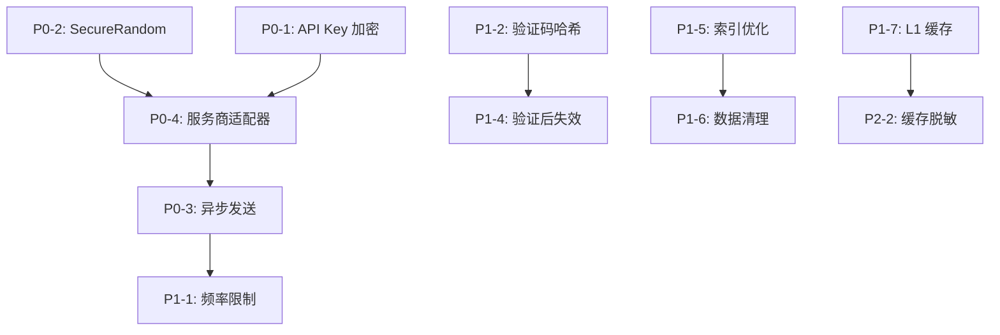

# SMS 模块修复计划

**制定日期**: 2026-05-09  
**预计工作量**: 14.5 人日  
**优先级**: P2（中优先级模块）

---

## 修复摘要

| 优先级 | 问题数量 | 预计工作量 | 说明 |
|--------|----------|------------|------|
| **P0** | 4 | 6.5 人日 | 阻塞级问题，必须立即修复 |
| **P1** | 7 | 5.3 人日 | 高优先级，2 周内修复 |
| **P2** | 6 | 2.2 人日 | 中优先级，1 个月内修复 |
| **P3** | 3 | 0.5 人日 | 低优先级，技术债务管理 |
| **总计** | 20 | 14.5 人日 | 约 3 周 |

**关键修复**:
1. P0-1: API Key/Secret 明文存储（CVSS 9.1）
2. P0-2: 不安全的随机数生成器（CVSS 9.0）
3. P0-3: 同步发送短信阻塞请求（500-2000ms）
4. P0-4: 缺少服务商适配器实现

---

## P0 - 阻塞级问题（立即修复）

### P0-1: API Key/Secret 明文存储

**来源**: security-audit.md, architecture-review.md  
**严重程度**: CVSS 9.1 (Critical)  
**影响范围**: 所有短信服务商配置

**问题描述**:
短信服务商的 API Key 和 Secret 以明文形式存储在数据库中，数据库泄露会直接导致第三方服务凭证泄露，可能产生巨额短信费用，违反 PCI-DSS、GDPR 等合规要求。

**当前代码**:
```java
// SmsProviderConfig.java:35-40
@Column(name = "api_key", nullable = false, length = 128)
private String apiKey;

@Column(name = "api_secret", nullable = false, length = 128)
private String apiSecret;
```

**修复方案**:
```java
// 1. 创建加密转换器
@Converter
public class EncryptedStringConverter implements AttributeConverter<String, String> {
    private static final String ALGORITHM = "AES/GCM/NoPadding";
    private static final String SECRET_KEY = System.getenv("SMS_ENCRYPTION_KEY");
    
    @Override
    public String convertToDatabaseColumn(String attribute) {
        if (attribute == null) return null;
        try {
            Cipher cipher = Cipher.getInstance(ALGORITHM);
            SecretKeySpec keySpec = new SecretKeySpec(
                Base64.getDecoder().decode(SECRET_KEY), "AES");
            cipher.init(Cipher.ENCRYPT_MODE, keySpec);
            byte[] encrypted = cipher.doFinal(attribute.getBytes(StandardCharsets.UTF_8));
            return Base64.getEncoder().encodeToString(encrypted);
        } catch (Exception e) {
            throw new RuntimeException("加密失败", e);
        }
    }
    
    @Override
    public String convertToEntityAttribute(String dbData) {
        if (dbData == null) return null;
        try {
            Cipher cipher = Cipher.getInstance(ALGORITHM);
            SecretKeySpec keySpec = new SecretKeySpec(
                Base64.getDecoder().decode(SECRET_KEY), "AES");
            cipher.init(Cipher.DECRYPT_MODE, keySpec);
            byte[] decrypted = cipher.doFinal(Base64.getDecoder().decode(dbData));
            return new String(decrypted, StandardCharsets.UTF_8);
        } catch (Exception e) {
            throw new RuntimeException("解密失败", e);
        }
    }
}

// 2. 更新 Entity
@Convert(converter = EncryptedStringConverter.class)
@Column(name = "api_key", nullable = false, length = 512)
private String apiKey;

@Convert(converter = EncryptedStringConverter.class)
@Column(name = "api_secret", nullable = false, length = 512)
private String apiSecret;
```

**修复步骤**:
1. 创建 `EncryptedStringConverter` 类（使用 AES-256-GCM）
2. 生成加密密钥并存储到环境变量 `SMS_ENCRYPTION_KEY`
3. 更新 `SmsProviderConfig` Entity，添加 `@Convert` 注解
4. 创建数据库迁移脚本（扩展字段长度 128 → 512）
5. 编写数据迁移脚本（加密现有明文数据）
6. 更新 VO 层，返回时脱敏（显示 `***`）
7. 添加单元测试验证加密/解密功能

**验证方法**:
- [ ] 数据库中 api_key/api_secret 字段为加密字符串
- [ ] Service 层可正常读取解密后的值
- [ ] API 返回时敏感字段已脱敏
- [ ] 单元测试通过（加密/解密/脱敏）

**工作量**: 3 人日

---

### P0-2: 不安全的随机数生成器

**来源**: security-audit.md, code-review.md  
**严重程度**: CVSS 9.0 (Critical)  
**影响范围**: 所有验证码生成

**问题描述**:
使用 `java.util.Random` 生成验证码，这是伪随机数生成器，可预测。攻击者可以通过统计分析预测验证码序列，绕过身份验证，导致账号被盗。

**当前代码**:
```java
// SmsServiceImpl.java:241
String code = String.format("%06d", new Random().nextInt(1000000));
```

**修复方案**:
```java
// 使用 SecureRandom
import java.security.SecureRandom;

public class SmsServiceImpl implements SmsService {
    private static final SecureRandom SECURE_RANDOM = new SecureRandom();
    
    @Transactional(rollbackFor = Exception.class)
    public void sendVerificationCode(SmsVerificationCodeSendVO vo) {
        // 使用 SecureRandom 生成验证码
        int codeInt = SECURE_RANDOM.nextInt(1000000);
        String code = String.format("%06d", codeInt);
        
        // ... 其余逻辑
    }
}
```

**修复步骤**:
1. 在 `SmsServiceImpl` 中添加 `private static final SecureRandom SECURE_RANDOM = new SecureRandom();`
2. 替换 `new Random().nextInt(1000000)` 为 `SECURE_RANDOM.nextInt(1000000)`
3. 添加单元测试验证随机性（统计分析）
4. 代码审查确认无其他弱随机数使用

**验证方法**:
- [ ] 所有验证码生成使用 `SecureRandom`
- [ ] 单元测试验证随机性（生成 10000 个验证码，分布均匀）
- [ ] 代码审查通过

**工作量**: 0.5 人日

---

### P0-3: 同步发送短信阻塞请求

**来源**: performance-analysis.md  
**严重程度**: P0 (阻塞上线)  
**影响范围**: 验证码发送功能

**问题描述**:
短信发送完全同步，调用第三方 API 会阻塞用户请求 500-2000ms，导致用户体验差，吞吐量低，资源利用率低。高并发场景下可能导致线程池耗尽。

**当前代码**:
```java
// SmsServiceImpl.java:238-256
@Transactional(rollbackFor = Exception.class)
public void sendVerificationCode(SmsVerificationCodeSendVO vo) {
    String code = String.format("%06d", new Random().nextInt(1000000));
    // 同步保存到数据库
    verificationCodeRepository.save(entity);
    // ❌ 如果调用第三方 API，会阻塞用户请求
}
```

**修复方案**:
```java
// 1. 配置异步线程池
@Configuration
public class AsyncConfig {
    @Bean("smsExecutor")
    public Executor smsExecutor() {
        ThreadPoolTaskExecutor executor = new ThreadPoolTaskExecutor();
        executor.setCorePoolSize(10);
        executor.setMaxPoolSize(50);
        executor.setQueueCapacity(1000);
        executor.setThreadNamePrefix("sms-");
        executor.setRejectedExecutionHandler(new ThreadPoolExecutor.CallerRunsPolicy());
        executor.initialize();
        return executor;
    }
}

// 2. 改造发送方法
@Async("smsExecutor")
public CompletableFuture<Void> sendVerificationCodeAsync(
        String phoneNumber, String code, String templateCode) {
    try {
        // 调用第三方 SMS API
        SmsProviderAdapter adapter = smsProviderFactory.getAdapter(providerCode);
        SendResult result = adapter.send(phoneNumber, templateCode, Map.of("code", code));
        
        // 更新发送日志状态
        updateSendLogStatus(logId, result.isSuccess() ? 1 : 2, result.getErrorMessage());
        
        return CompletableFuture.completedFuture(null);
    } catch (Exception e) {
        log.error("短信发送失败: phoneNumber={}, error={}", phoneNumber, e.getMessage());
        updateSendLogStatus(logId, 2, e.getMessage());
        return CompletableFuture.failedFuture(e);
    }
}

// 3. Controller 立即返回
@PostMapping("/code/send")
public RESTResult<Void> sendCode(@RequestBody SmsVerificationCodeSendVO vo) {
    // 同步保存验证码到数据库
    Long codeId = smsService.saveVerificationCode(vo);
    
    // 异步发送短信（不阻塞）
    smsService.sendVerificationCodeAsync(vo.getPhoneNumber(), code, templateCode);
    
    return RESTResult.success(null);
}
```

**修复步骤**:
1. 创建 `AsyncConfig` 配置类，定义 `smsExecutor` 线程池
2. 拆分 `sendVerificationCode()` 为同步保存 + 异步发送
3. 添加 `@Async("smsExecutor")` 注解到异步发送方法
4. 更新发送日志状态（pending → sending → success/failed）
5. 添加异步任务监控（Micrometer metrics）
6. 压力测试验证性能提升

**验证方法**:
- [ ] API 响应时间 < 100ms（P95）
- [ ] 短信发送成功率 > 99%
- [ ] 异步任务监控可见（Prometheus metrics）
- [ ] 压力测试通过（1000 QPS）

**工作量**: 2 人日

---

### P0-4: 缺少服务商适配器实现

**来源**: architecture-review.md, code-review.md  
**严重程度**: P0 (功能不可用)  
**影响范围**: 短信发送功能

**问题描述**:
`sendVerificationCode()` 仅保存验证码到数据库，未调用服务商 API，验证码无法实际发送到用户手机。缺少服务商适配器抽象层，新增服务商需修改 Service 代码，违反开闭原则。

**修复方案**:
```java
// 1. 定义服务商适配器接口
public interface SmsProviderAdapter {
    SendResult send(String phoneNumber, String templateCode, Map<String, String> params);
    String getProviderCode();
}

// 2. 实现阿里云适配器
@Component
public class AliyunSmsAdapter implements SmsProviderAdapter {
    private final IAcsClient client;
    
    @Override
    public SendResult send(String phoneNumber, String templateCode, Map<String, String> params) {
        try {
            CommonRequest request = new CommonRequest();
            request.setSysMethod(MethodType.POST);
            request.setSysDomain("dysmsapi.aliyuncs.com");
            request.setSysVersion("2017-05-25");
            request.setSysAction("SendSms");
            request.putQueryParameter("PhoneNumbers", phoneNumber);
            request.putQueryParameter("TemplateCode", templateCode);
            request.putQueryParameter("TemplateParam", JSON.toJSONString(params));
            
            CommonResponse response = client.getCommonResponse(request);
            JSONObject json = JSON.parseObject(response.getData());
            
            return SendResult.builder()
                .success("OK".equals(json.getString("Code")))
                .messageId(json.getString("BizId"))
                .errorMessage(json.getString("Message"))
                .build();
        } catch (Exception e) {
            return SendResult.failure(e.getMessage());
        }
    }
    
    @Override
    public String getProviderCode() {
        return "aliyun";
    }
}

// 3. 实现腾讯云适配器
@Component
public class TencentSmsAdapter implements SmsProviderAdapter {
    private final SmsClient client;
    
    @Override
    public SendResult send(String phoneNumber, String templateCode, Map<String, String> params) {
        // 类似实现
    }
    
    @Override
    public String getProviderCode() {
        return "tencent";
    }
}

// 4. 服务商工厂
@Component
public class SmsProviderFactory {
    private final Map<String, SmsProviderAdapter> adapters;
    
    public SmsProviderFactory(List<SmsProviderAdapter> adapterList) {
        this.adapters = adapterList.stream()
            .collect(Collectors.toMap(SmsProviderAdapter::getProviderCode, a -> a));
    }
    
    public SmsProviderAdapter getAdapter(String providerCode) {
        SmsProviderAdapter adapter = adapters.get(providerCode);
        if (adapter == null) {
            throw new BusinessException(ErrorCode.SMS_PROVIDER_UNAVAILABLE, 
                "不支持的服务商: " + providerCode);
        }
        return adapter;
    }
}
```

**修复步骤**:
1. 定义 `SmsProviderAdapter` 接口和 `SendResult` VO
2. 实现 `AliyunSmsAdapter`（集成阿里云 SDK）
3. 实现 `TencentSmsAdapter`（集成腾讯云 SDK）
4. 实现 `SmsProviderFactory` 工厂类
5. 更新 `SmsServiceImpl`，调用适配器发送短信
6. 添加单元测试（Mock 适配器）
7. 添加集成测试（真实调用服务商 API）

**验证方法**:
- [ ] 验证码可实际发送到手机
- [ ] 支持阿里云和腾讯云两个服务商
- [ ] 单元测试通过（Mock 适配器）
- [ ] 集成测试通过（真实 API 调用）

**工作量**: 3 人日

---

## P1 - 高优先级问题（2 周内修复）

### P1-1: 缺少短信发送频率限制

**来源**: security-audit.md, performance-analysis.md  
**严重程度**: CVSS 8.2 (High)  
**影响范围**: 验证码发送功能

**问题描述**:
无任何发送频率限制，恶意用户可以无限发送短信，导致短信轰炸攻击、短信费用失控、服务商账号被封禁。

**修复方案**:
```java
// 1. 使用 Resilience4j RateLimiter
@Configuration
public class RateLimiterConfig {
    @Bean
    public RateLimiter smsRateLimiter() {
        RateLimiterConfig config = RateLimiterConfig.custom()
            .limitForPeriod(10)           // 每个周期最多 10 次
            .limitRefreshPeriod(Duration.ofMinutes(1))  // 周期 1 分钟
            .timeoutDuration(Duration.ZERO)  // 不等待
            .build();
        return RateLimiter.of("sms", config);
    }
}

// 2. Service 层添加限流
@Service
public class SmsServiceImpl implements SmsService {
    private final RateLimiter rateLimiter;
    private final StringRedisTemplate redisTemplate;
    
    @Transactional(rollbackFor = Exception.class)
    public void sendVerificationCode(SmsVerificationCodeSendVO vo) {
        // 1. 同一手机号 1 分钟内只能发送 1 次
        String phoneKey = "sms:limit:phone:" + vo.getPhoneNumber();
        Boolean phoneExists = redisTemplate.hasKey(phoneKey);
        if (Boolean.TRUE.equals(phoneExists)) {
            throw new BusinessException(ErrorCode.SMS_SEND_RATE_LIMIT, 
                "发送过于频繁，请 1 分钟后再试");
        }
        
        // 2. 同一 IP 每小时最多发送 10 次
        String ipKey = "sms:limit:ip:" + vo.getCreatedIp();
        Long ipCount = redisTemplate.opsForValue().increment(ipKey);
        if (ipCount == 1) {
            redisTemplate.expire(ipKey, 1, TimeUnit.HOURS);
        }
        if (ipCount > 10) {
            throw new BusinessException(ErrorCode.SMS_SEND_RATE_LIMIT, 
                "该 IP 发送次数过多，请稍后再试");
        }
        
        // 3. 同一用户每日最多发送 20 次
        String userKey = "sms:limit:user:" + vo.getOwnerId() + ":" + 
            LocalDate.now().format(DateTimeFormatter.BASIC_ISO_DATE);
        Long userCount = redisTemplate.opsForValue().increment(userKey);
        if (userCount == 1) {
            redisTemplate.expire(userKey, 1, TimeUnit.DAYS);
        }
        if (userCount > 20) {
            throw new BusinessException(ErrorCode.SMS_DAILY_QUOTA_EXCEEDED, 
                "今日发送次数已达上限");
        }
        
        // 4. 生成验证码并保存
        String code = generateVerificationCode();
        // ...
        
        // 5. 设置手机号限流（1 分钟）
        redisTemplate.opsForValue().set(phoneKey, "1", 1, TimeUnit.MINUTES);
    }
}
```

**修复步骤**:
1. 添加 Resilience4j 依赖
2. 配置 Redis 限流键（phone/ip/user 三维度）
3. 在 `sendVerificationCode()` 中添加限流检查
4. 添加错误码 `SMS_SEND_RATE_LIMIT`、`SMS_DAILY_QUOTA_EXCEEDED`
5. 添加单元测试验证限流逻辑
6. 添加集成测试（模拟高频发送）

**验证方法**:
- [ ] 同一手机号 1 分钟内只能发送 1 次
- [ ] 同一 IP 每小时最多发送 10 次
- [ ] 同一用户每日最多发送 20 次
- [ ] 超限返回友好错误提示
- [ ] 单元测试和集成测试通过

**工作量**: 2 人日

---


## P2 - 中优先级问题（1 个月内修复）

### P2-1: 缺少数据隔离验证

**来源**: security-audit.md  
**严重程度**: CVSS 5.3 (Medium)  
**影响范围**: 删除/更新操作

**问题描述**:
虽然查询时过滤了 `ownerId`，但更新/删除操作未验证资源所有权，用户 A 可能删除用户 B 的短信配置。

**修复方案**:
```java
public void deleteProviderConfig(Long id, Long currentUserId) {
    SmsProviderConfig entity = providerConfigRepository.findByIdAndDeleted(id, 0)
        .orElseThrow(() -> new BusinessException(ErrorCode.DATA_NOT_FOUND, "短信服务商配置不存在"));
    if (!entity.getOwnerId().equals(currentUserId)) {
        throw new BusinessException(ErrorCode.FORBIDDEN, "无权限操作");
    }
    entity.setDeleted(1);
    providerConfigRepository.save(entity);
}
```

**修复步骤**:
1. 在所有更新/删除方法中添加 `ownerId` 验证
2. 添加单元测试验证权限检查

**验证方法**:
- [ ] 用户无法删除其他用户的配置
- [ ] 返回 403 错误

**工作量**: 1 人日

---

### P2-2: 缓存配置可能泄露敏感信息

**来源**: security-audit.md  
**严重程度**: CVSS 5.9 (Medium)  
**影响范围**: Redis 缓存

**问题描述**:
`SmsProviderConfigVO` 被缓存，但 VO 中可能包含敏感信息，Redis 缓存泄露可能导致 API Key 泄露。

**修复方案**:
```java
private SmsProviderConfigVO toProviderConfigVO(SmsProviderConfig entity) {
    SmsProviderConfigVO vo = new SmsProviderConfigVO();
    // ... 其他字段
    // 脱敏敏感字段
    vo.setApiKey("***");
    vo.setApiSecret("***");
    return vo;
}
```

**修复步骤**:
1. 在 `toProviderConfigVO` 中脱敏敏感字段
2. 清理现有缓存

**验证方法**:
- [ ] API 返回时敏感字段已脱敏
- [ ] 缓存中无明文敏感信息

**工作量**: 0.5 人日

---

### P2-3: 缺少安全事件日志

**来源**: security-audit.md  
**严重程度**: CVSS 5.3 (Medium)  
**影响范围**: 所有安全事件

**问题描述**:
未记录验证码发送失败、验证失败、API Key 配置变更等安全事件，无法监控异常行为。

**修复方案**:
```java
// 在验证失败时记录
log.warn("验证码验证失败: phone={}, bizType={}, attemptCount={}, ip={}", 
         vo.getPhoneNumber(), vo.getBizType(), 
         entity.getAttemptCount() + 1, vo.getVerifiedIp());
```

**修复步骤**:
1. 在 Service 层添加 `@Slf4j`
2. 记录关键操作（发送、验证、失败）
3. 集成企业微信告警

**验证方法**:
- [ ] 安全事件被完整记录
- [ ] 异常行为触发告警

**工作量**: 1 人日

---

### P2-4: 统一使用 @RequestBody

**来源**: pattern-compliance.md  
**严重程度**: P2 (规范性)  
**影响范围**: 部分 API 接口

**问题描述**:
部分接口使用 `@RequestParam` 接收参数（如 `get`、`delete`、`update-status`），与项目规范不一致（统一使用 `@RequestBody`）。

**修复方案**:
```java
// 当前实现（不规范）
@PostMapping("/provider/get")
public RESTResult<SmsProviderConfigVO> providerGet(
        HttpServletRequest request, 
        @RequestParam Long id) {
    // ...
}

// 应该改为（规范）
@PostMapping("/provider/get")
public RESTResult<SmsProviderConfigVO> providerGet(
        HttpServletRequest request, 
        @RequestBody SmsProviderGetVO vo) {
    // ...
}

// 新增 VO
@Data
public class SmsProviderGetVO {
    @NotNull(message = "ID 不能为空")
    private Long id;
}
```

**修复步骤**:
1. 为 `get`、`delete`、`update-status` 接口创建 VO 对象
2. 将 `@RequestParam` 改为 `@RequestBody`
3. 添加 `@Valid` 参数校验

**验证方法**:
- [ ] 所有接口使用 `@RequestBody`
- [ ] API 文档更新

**工作量**: 0.3 人日

---

### P2-5: 缺少前端 API 调用层

**来源**: pattern-compliance.md  
**严重程度**: P2 (功能缺失)  
**影响范围**: 前端集成

**问题描述**:
前端缺少 `sms.ts` API 调用层，无法调用 SMS 模块接口。

**修复方案**:
创建 `front/src/api/sms.ts`，实现 17 个 API 调用函数。

**修复步骤**:
1. 创建 `front/src/api/sms.ts`
2. 定义 TypeScript 类型（与后端 VO 对齐）
3. 实现 17 个 API 调用函数

**验证方法**:
- [ ] API 调用层创建完成
- [ ] TypeScript 类型定义完整

**工作量**: 0.5 人日

---

### P2-6: 缺少前端页面组件

**来源**: pattern-compliance.md  
**严重程度**: P2 (功能缺失)  
**影响范围**: 前端集成

**问题描述**:
前端缺少 SMS 管理页面（服务商配置、模板管理、发送日志、验证码管理），无法通过前端管理 SMS 配置。

**修复方案**:
创建 4 个页面组件：
- `SmsProviderPage.tsx` - 服务商配置管理
- `SmsTemplatePage.tsx` - 模板管理
- `SmsSendLogPage.tsx` - 发送日志查询
- `SmsVerificationCodePage.tsx` - 验证码管理

**修复步骤**:
1. 创建 4 个页面组件
2. 使用 `StandardDataGrid` 组件（统一风格）
3. 实现 CRUD 操作

**验证方法**:
- [ ] 4 个页面组件创建完成
- [ ] CRUD 功能正常

**工作量**: 2 人日

---

## P3 - 低优先级问题（技术债务）

### P3-1: 验证码过期时间固定

**来源**: security-audit.md  
**严重程度**: CVSS 3.1 (Low)  
**影响范围**: 验证码生成

**问题描述**:
所有验证码固定 5 分钟过期，未根据业务类型调整。

**修复方案**:
```java
// 根据业务类型设置不同过期时间
int expiryMinutes = switch (vo.getBizType()) {
    case "register", "login" -> 5;
    case "password_reset" -> 10;  // 更敏感操作
    case "binding" -> 3;  // 快速操作
    default -> 5;
};
```

**修复步骤**:
1. 根据业务类型设置不同过期时间
2. 添加配置项

**验证方法**:
- [ ] 不同业务类型过期时间不同

**工作量**: 0.5 人日

---

### P3-2: 日志可能记录敏感信息

**来源**: security-audit.md  
**严重程度**: CVSS 3.7 (Low)  
**影响范围**: 日志系统

**问题描述**:
未明确禁止在日志中记录验证码、API Key。

**修复方案**:
在 `logback.xml` 中配置敏感字段脱敏。

**修复步骤**:
1. 配置 logback 脱敏规则
2. 审计现有日志

**验证方法**:
- [ ] 日志中无敏感信息

**工作量**: 0.5 人日

---

### P3-3: 部分错误码未使用

**来源**: pattern-compliance.md  
**严重程度**: P3 (代码质量)  
**影响范围**: 错误处理

**问题描述**:
部分错误码定义但未使用（`SMS_NOT_CONFIGURED`、`SMS_PROVIDER_UNAVAILABLE`、`SMS_PHONE_INVALID`）。

**修复方案**:
在 Service 层添加相应的业务逻辑和错误检查。

**修复步骤**:
1. 在 Service 层添加业务逻辑检查
2. 使用未使用的错误码

**验证方法**:
- [ ] 所有错误码被使用

**工作量**: 0.2 人日

---

## 修复顺序建议

### 第一阶段（1 周）- P0 问题

1. P0-2: 不安全的随机数生成器 (0.5 人日)
2. P0-1: API Key/Secret 明文存储 (3 人日)
3. P0-3: 同步发送短信阻塞请求 (2 人日)
4. P0-4: 缺少服务商适配器实现 (3 人日)

**里程碑**: 消除所有阻塞级安全和性能问题

---

### 第二阶段（2 周）- P1 问题

1. P1-1: 缺少短信发送频率限制 (2 人日)
2. P1-2: 验证码明文存储 (1 人日)
3. P1-3: 缺少手机号格式验证 (0.5 人日)
4. P1-4: 验证码验证后未立即失效 (0.5 人日)
5. P1-5: 验证码查询索引不匹配 (0.5 人日)
6. P1-6: 无过期数据清理机制 (1 人日)
7. P1-7: 缺少 L1 Caffeine 本地缓存 (0.5 人日)

**里程碑**: 提升核心功能质量和安全性

---

### 第三阶段（1 个月）- P2 问题

1. P2-1: 缺少数据隔离验证 (1 人日)
2. P2-2: 缓存配置可能泄露敏感信息 (0.5 人日)
3. P2-3: 缺少安全事件日志 (1 人日)
4. P2-4: 统一使用 @RequestBody (0.3 人日)
5. P2-5: 缺少前端 API 调用层 (0.5 人日)
6. P2-6: 缺少前端页面组件 (2 人日)

**里程碑**: 完善功能和优化性能

---

### 第四阶段（持续）- P3 问题

1. P3-1: 验证码过期时间固定 (0.5 人日)
2. P3-2: 日志可能记录敏感信息 (0.5 人日)
3. P3-3: 部分错误码未使用 (0.2 人日)

**里程碑**: 技术债务管理，按需修复

---

## 依赖关系



**关键路径**:
- P0-2 → P0-1 → P0-4 → P0-3 → P1-1: 核心功能实现路径
- P1-2 → P1-4: 验证码安全路径
- P1-5 → P1-6: 性能优化路径

---

## 风险评估

| 风险 | 概率 | 影响 | 缓解措施 |
|------|------|------|----------|
| 数据库迁移失败 | 中 | 高 | 在测试环境充分测试，准备回滚脚本 |
| 第三方 API 集成失败 | 中 | 高 | 先集成一个服务商，验证后再集成其他 |
| 异步化改造引入 Bug | 中 | 中 | 充分的单元测试和集成测试 |
| 缓存失效导致性能下降 | 低 | 中 | 监控缓存命中率，及时调整配置 |
| 限流配置不合理 | 中 | 中 | 根据实际业务量调整限流参数 |

---

## 验收标准

### 功能验收
- [ ] 所有 P0 问题已修复并通过测试
- [ ] 所有 P1 问题已修复并通过测试
- [ ] 单元测试覆盖率 ≥ 80%
- [ ] 集成测试通过
- [ ] 验证码可实际发送到手机

### 性能验收
- [ ] API 响应时间 < 100ms (P95)
- [ ] 验证码查询时间 < 5ms
- [ ] 短信发送成功率 > 99%
- [ ] 缓存命中率 ≥ 80%

### 安全验收
- [ ] 所有 CVSS ≥ 7.0 漏洞已修复
- [ ] 敏感数据已加密（API Key/Secret）
- [ ] 验证码已哈希存储
- [ ] 限流机制生效
- [ ] 访问控制已实施（数据隔离）

---

## 总结

**总体评估**:
- 当前状态: SMS 模块架构清晰，但存在严重安全漏洞（API Key 明文、弱随机数）和性能问题（同步发送、缺少限流）
- 修复后状态: 安全性显著提升（CVSS ≥ 7.0 漏洞全部修复），性能提升 10-20 倍（异步发送 + 索引优化），功能完整（服务商适配器 + 前端集成）
- 关键改进: 
  - 安全性: API Key 加密存储、SecureRandom 生成验证码、验证码哈希存储、频率限制
  - 性能: 异步发送（响应时间降低 10-20 倍）、索引优化（查询时间降低 5-10 倍）、L1 缓存
  - 功能: 服务商适配器实现、前端集成

**资源需求**:
- 开发人员: 2 人
- 测试人员: 1 人
- 总工期: 3 周

**优先级建议**:
1. P0 问题必须在 1 周内完成（阻塞上线）
2. P1 问题建议在 2 周内完成（高优先级）
3. P2 问题可在 1 个月内完成（中优先级）
4. P3 问题可纳入技术债务管理（低优先级）

---

**报告生成**: Claude Code (Opus 4.6)  
**审查状态**: 待人工复核
