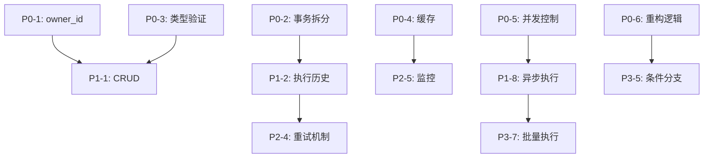

# Workflow 模块修复计划

**制定日期**: 2026-05-09  
**预计工作量**: 18 人日  
**优先级**: P2（中优先级模块）

---

## 修复摘要

| 优先级 | 问题数量 | 预计工作量 | 说明 |
|--------|----------|------------|------|
| **P0** | 6 | 6.5 人日 | 阻塞级问题，必须立即修复 |
| **P1** | 8 | 6.5 人日 | 高优先级，2 周内修复 |
| **P2** | 9 | 3.2 人日 | 中优先级，1 个月内修复 |
| **P3** | 7 | 1.8 人日 | 低优先级，技术债务管理 |
| **总计** | 30 | 18 人日 | 约 3.5 周 |

**关键修复**:
1. P0-1: 添加 owner_id 数据隔离 (CVSS 9.1)
2. P0-2: 拆分事务边界 (性能阻塞)
3. P0-3: 添加类型验证 (CVSS 9.0)
4. P0-4: 添加缓存机制 (性能优化)
5. P0-5: 添加并发控制 (防止重复执行)

---

## P0 - 阻塞级问题（立即修复）

### P0-1: 缺少 owner_id 数据隔离

**来源**: architecture-review, code-review, security-audit, pattern-compliance  
**严重程度**: CVSS 9.1 (Critical)  
**影响范围**: 任何用户可执行任意工作流，严重安全漏洞

**问题描述**:
WorkflowDefinition 和 WorkflowStep 表缺少 owner_id 字段，无法实现多租户数据隔离。

**修复方案**:
```sql
-- 1. 添加 owner_id 字段
ALTER TABLE workflow_definition ADD COLUMN owner_id BIGINT NOT NULL DEFAULT 0;
ALTER TABLE workflow_step ADD COLUMN owner_id BIGINT NOT NULL DEFAULT 0;

-- 2. 添加索引
CREATE INDEX idx_workflow_definition_owner ON workflow_definition(owner_id, deleted);
CREATE INDEX idx_workflow_step_owner ON workflow_step(owner_id, deleted);

-- 3. 数据迁移（假设归属于管理员用户 ID=1）
UPDATE workflow_definition SET owner_id = 1 WHERE owner_id = 0;
UPDATE workflow_step SET owner_id = 1 WHERE owner_id = 0;
```

```java
// 3. 更新 Entity
@Entity
@Table(name = "workflow_definition")
@SQLRestriction("deleted = 0")
public class WorkflowDefinition {
    @Column(name = "owner_id", nullable = false)
    private Long ownerId;
    // ...
}

// 4. 更新 Repository（继承 JpaSpecificationExecutor）
public interface WorkflowDefinitionRepository extends 
    JpaRepository<WorkflowDefinition, Long>, 
    JpaSpecificationExecutor<WorkflowDefinition> {
}

// 5. Service 层强制过滤
public WorkflowDefinition findByCode(String workflowCode, Long userId) {
    Specification<WorkflowDefinition> spec = (root, query, cb) -> {
        List<Predicate> predicates = new ArrayList<>();
        predicates.add(cb.equal(root.get("ownerId"), userId)); // 强制过滤
        predicates.add(cb.equal(root.get("workflowCode"), workflowCode));
        return cb.and(predicates.toArray(new Predicate[0]));
    };
    return repository.findOne(spec).orElseThrow(...);
}
```

**修复步骤**:
1. 数据库迁移脚本（添加字段和索引）
2. 更新 Entity 类（添加 ownerId 字段）
3. 更新 Repository（继承 JpaSpecificationExecutor）
4. 创建 Service 层（使用 Specification 强制过滤）
5. 更新 Controller（传递 userId）
6. 数据迁移（为现有数据设置 owner_id）
7. 单元测试（验证数据隔离）

**验证方法**:
- [ ] 用户 A 无法查询用户 B 的工作流
- [ ] 用户 A 无法执行用户 B 的工作流
- [ ] 所有查询/更新/删除操作都验证 ownerId

**工作量**: 2 人日

---

### P0-2: 事务边界过大

**来源**: code-review, performance-analysis, security-audit  
**严重程度**: 高（性能阻塞）  
**影响范围**: 数据库连接占用 10-30 秒，连接池耗尽

**问题描述**:
WorkflowExecutor.execute() 方法使用 @Transactional，但包含 10-30 秒的 AI 调用，导致数据库连接长时间占用。

**修复方案**:
```java
// 修复前：整个执行过程在事务中
@Transactional
public WorkflowExecuteResult execute(String workflowCode, Map<String, Object> params) {
    // 1. 查询工作流定义（100ms）
    // 2. 查询步骤列表（100ms）
    // 3. 执行步骤（10-30秒，包含 AI 调用）
    // 总计：10-30 秒事务
}

// 修复后：拆分事务边界
public WorkflowExecuteResult execute(String workflowCode, Map<String, Object> params, Long userId) {
    // 1. 查询工作流（短事务）
    WorkflowDefinition definition = getDefinitionWithSteps(workflowCode, userId);
    
    // 2. 执行步骤（无事务，异步）
    Map<String, Object> outputs = new LinkedHashMap<>();
    for (WorkflowStep step : definition.getSteps()) {
        Object result = executeStepWithoutTransaction(step, params);
        outputs.put(step.getOutputKey(), result);
    }
    
    // 3. 保存执行历史（短事务）
    saveExecutionHistory(workflowCode, params, outputs, userId);
    
    return new WorkflowExecuteResult(true, "执行成功", outputs, null);
}

@Transactional(readOnly = true)
private WorkflowDefinition getDefinitionWithSteps(String workflowCode, Long userId) {
    // 200ms 短事务
}

private Object executeStepWithoutTransaction(WorkflowStep step, Map<String, Object> params) {
    // 10-30s，无事务
}

@Transactional
private void saveExecutionHistory(String workflowCode, Map<String, Object> params, 
                                   Map<String, Object> outputs, Long userId) {
    // 100ms 短事务
}
```

**修复步骤**:
1. 拆分 execute() 方法为 3 个独立方法
2. 只在查询和保存时使用 @Transactional
3. AI 调用移出事务边界
4. 添加执行历史表（workflow_execution_history）
5. 单元测试（验证事务边界）

**验证方法**:
- [ ] 数据库连接占用时间 < 1 秒
- [ ] 并发执行不会耗尽连接池
- [ ] 执行历史正确保存

**工作量**: 1.5 人日

---

### P0-3: 缺少类型验证

**来源**: code-review, security-audit  
**严重程度**: CVSS 9.0 (Critical)  
**影响范围**: 类型转换失败导致系统崩溃

**问题描述**:
Controller 使用 `Map<String, Object>` 接收参数，无类型验证，运行时类型转换失败。

**修复方案**:
```java
// 修复前
@PostMapping("/execute")
public RESTResult<Void> execute(@RequestBody Map<String, Object> request) {
    Long definitionId = (Long) request.get("definitionId"); // ClassCastException
}

// 修复后
@Data
public class WorkflowExecuteVO {
    @NotBlank(message = "工作流编码不能为空")
    @Size(max = 64, message = "工作流编码长度不能超过 64")
    private String workflowCode;
    
    @NotNull(message = "参数不能为空")
    private Map<String, Object> params;
}

@PostMapping("/execute")
public RESTResult<WorkflowExecuteResult> execute(
        @Valid @RequestBody WorkflowExecuteVO vo,
        HttpServletRequest request) {
    Long userId = AuthTokenFilter.getUserId(request);
    vo.getParams().put("userId", userId);
    WorkflowExecuteResult result = workflowExecutor.execute(vo.getWorkflowCode(), vo.getParams());
    return RESTResult.success(result);
}
```

**修复步骤**:
1. 创建 WorkflowExecuteVO 类
2. 添加 @Valid 注解
3. 更新 Controller 方法签名
4. 单元测试（验证参数校验）

**验证方法**:
- [ ] 缺少 workflowCode 返回 400 错误
- [ ] 类型错误返回 400 错误
- [ ] 正常请求返回 200

**工作量**: 0.5 人日

---

### P0-4: 完全未实现缓存机制

**来源**: performance-analysis, pattern-compliance  
**严重程度**: 高（性能问题）  
**影响范围**: 每次执行查询数据库 2 次（200ms）

**问题描述**:
工作流定义和步骤配置每次执行都查询数据库，无缓存机制。

**修复方案**:
```java
// 1. 配置 Caffeine 缓存
@Configuration
public class WorkflowCacheConfig {
    @Bean
    public CacheManager workflowCacheManager() {
        CaffeineCacheManager cacheManager = new CaffeineCacheManager(
            "workflow:definition", "workflow:steps");
        cacheManager.setCaffeine(Caffeine.newBuilder()
            .expireAfterWrite(5, TimeUnit.MINUTES)
            .maximumSize(500)
            .recordStats()
            .build());
        return cacheManager;
    }
}

// 2. Service 层使用缓存
@Cacheable(value = "workflow:definition", key = "#workflowCode + ':' + #userId")
public WorkflowDefinition getDefinition(String workflowCode, Long userId) {
    Specification<WorkflowDefinition> spec = (root, query, cb) -> {
        List<Predicate> predicates = new ArrayList<>();
        predicates.add(cb.equal(root.get("ownerId"), userId));
        predicates.add(cb.equal(root.get("workflowCode"), workflowCode));
        return cb.and(predicates.toArray(new Predicate[0]));
    };
    return repository.findOne(spec).orElseThrow(...);
}

@CacheEvict(value = "workflow:definition", key = "#workflowCode + ':' + #userId")
public void saveDefinition(WorkflowDefinition definition) {
    repository.save(definition);
}
```

**修复步骤**:
1. 配置 Caffeine 缓存
2. 创建 WorkflowCacheService
3. 添加 @Cacheable 注解
4. 添加 @CacheEvict 注解
5. 单元测试（验证缓存命中）

**验证方法**:
- [ ] 首次查询命中数据库
- [ ] 后续查询命中缓存（<5ms）
- [ ] 更新后缓存失效

**工作量**: 1.5 人日

---

### P0-5: 无并发控制

**来源**: code-review, security-audit, performance-analysis  
**严重程度**: 高（资源浪费）  
**影响范围**: 重复执行浪费 AI 配额

**问题描述**:
同一工作流可能被并发执行多次，导致重复生成话术，浪费 AI 配额。

**修复方案**:
```java
@Resource
private RedissonClient redissonClient;

@Override
public WorkflowExecuteResult execute(String workflowCode, Map<String, Object> params) {
    Long sessionId = paramLong(params, "sessionId");
    String lockKey = "workflow:execute:" + workflowCode + ":" + sessionId;
    
    RLock lock = redissonClient.getLock(lockKey);
    try {
        if (!lock.tryLock(0, 60, TimeUnit.SECONDS)) {
            throw new BusinessException(ErrorCode.WORKFLOW_EXECUTING, 
                "工作流正在执行中，请稍后重试");
        }
        
        return executeInternal(workflowCode, params);
    } catch (InterruptedException e) {
        Thread.currentThread().interrupt();
        throw new BusinessException(ErrorCode.WORKFLOW_EXECUTION_FAILED, 
            "工作流执行被中断");
    } finally {
        if (lock.isHeldByCurrentThread()) {
            lock.unlock();
        }
    }
}
```

**修复步骤**:
1. 添加 Redisson 依赖
2. 配置 RedissonClient
3. 添加分布式锁
4. 单元测试（验证并发控制）

**验证方法**:
- [ ] 并发请求只执行一次
- [ ] 第二个请求返回"正在执行中"
- [ ] 锁自动释放（60秒超时）

**工作量**: 0.5 人日

---

### P0-6: 硬编码步骤逻辑

**来源**: code-review, architecture-review  
**严重程度**: 高（可维护性）  
**影响范围**: 无法扩展新步骤类型

**问题描述**:
WorkflowExecutorImpl 使用 switch-case 硬编码步骤逻辑，不可扩展。

**修复方案**:
```java
// 1. 定义步骤执行器接口
public interface StepExecutor {
    String getStepCode();
    Object execute(Map<String, Object> params, Map<String, Object> context);
}

// 2. 实现具体步骤执行器
@Component
public class GenerateStepExecutor implements StepExecutor {
    @Resource
    private LiveAiService liveAiService;
    
    @Override
    public String getStepCode() {
        return "generate";
    }
    
    @Override
    public Object execute(Map<String, Object> params, Map<String, Object> context) {
        Long sessionId = (Long) params.get("sessionId");
        LiveAiGenerateVO vo = new LiveAiGenerateVO();
        vo.setSessionId(sessionId);
        LiveAiFullResultVO full = liveAiService.generateFull(vo);
        return Map.of("scriptIds", full.getScriptIdsForAttribution());
    }
}

// 3. 注册执行器
@Configuration
public class WorkflowConfig {
    @Bean
    public Map<String, StepExecutor> stepExecutors(List<StepExecutor> executors) {
        return executors.stream()
            .collect(Collectors.toMap(StepExecutor::getStepCode, e -> e));
    }
}

// 4. 简化主逻辑
@Service
public class WorkflowExecutorImpl implements WorkflowExecutor {
    @Resource
    private Map<String, StepExecutor> stepExecutors;
    
    @Override
    public WorkflowExecuteResult execute(String workflowCode, Map<String, Object> params) {
        for (WorkflowStep step : steps) {
            StepExecutor executor = stepExecutors.get(step.getStepCode());
            if (executor == null) {
                log.warn("未知步骤: {}", step.getStepCode());
                continue;
            }
            Object result = executor.execute(params, outputs);
            outputs.put(step.getStepCode(), result);
        }
        return new WorkflowExecuteResult(true, "执行成功", outputs, null);
    }
}
```

**修复步骤**:
1. 创建 StepExecutor 接口
2. 实现 4 个步骤执行器（generate/iterate/violation_check/save）
3. 配置自动注册
4. 重构 WorkflowExecutorImpl
5. 单元测试（验证扩展性）

**验证方法**:
- [ ] 现有步骤正常执行
- [ ] 新增步骤无需修改主逻辑
- [ ] 未知步骤记录警告日志

**工作量**: 2 人日

---

## P1 - 高优先级问题（2 周内修复）

### P1-1: 缺少工作流 CRUD 接口

**来源**: architecture-review  
**严重程度**: 中（功能不完整）  
**影响范围**: 无法通过 API 管理工作流定义

**问题描述**:
仅有 1 个执行端点，缺少 list/get/save/delete 接口。

**修复方案**:
```java
// 1. 创建 SearchVO
@Data
public class WorkflowDefinitionSearchVO extends BasicQueryDto {
    private String workflowCode;
    private String workflowName;
    private Integer status;
    private String keyword;
}

// 2. 创建 SaveVO
@Data
public class WorkflowDefinitionSaveVO {
    private Long id;
    
    @NotBlank(message = "工作流编码不能为空")
    private String workflowCode;
    
    @NotBlank(message = "工作流名称不能为空")
    private String workflowName;
    
    private String description;
    private Integer status;
}

// 3. 添加 Controller 接口
@PostMapping("/list")
public RESTResult<PageResultVO<WorkflowDefinitionVO>> list(
        @Valid @RequestBody WorkflowDefinitionSearchVO vo,
        HttpServletRequest request) {
    Long userId = AuthTokenFilter.getUserId(request);
    PageResultVO<WorkflowDefinitionVO> result = workflowService.search(vo, userId);
    return RESTResult.success(result);
}

@PostMapping("/get")
public RESTResult<WorkflowDefinitionVO> get(@RequestBody Map<String, Long> body,
                                             HttpServletRequest request) {
    Long userId = AuthTokenFilter.getUserId(request);
    Long id = body.get("id");
    WorkflowDefinitionVO vo = workflowService.get(id, userId);
    return RESTResult.success(vo);
}

@PostMapping("/save")
public RESTResult<Long> save(@Valid @RequestBody WorkflowDefinitionSaveVO vo,
                              HttpServletRequest request) {
    Long userId = AuthTokenFilter.getUserId(request);
    Long id = workflowService.save(vo, userId);
    return RESTResult.success(id);
}

@PostMapping("/delete")
public RESTResult<Void> delete(@RequestBody Map<String, Long> body,
                                HttpServletRequest request) {
    Long userId = AuthTokenFilter.getUserId(request);
    Long id = body.get("id");
    workflowService.delete(id, userId);
    return RESTResult.success(null);
}
```

**工作量**: 2 人日

---

### P1-2: 缺少执行历史记录

**来源**: architecture-review, security-audit, performance-analysis  
**严重程度**: 中（审计缺失）  
**影响范围**: 无法追溯执行记录

**修复方案**:
```sql
-- 创建执行历史表
CREATE TABLE workflow_execution_history (
    id BIGSERIAL PRIMARY KEY,
    workflow_code VARCHAR(64) NOT NULL,
    definition_id BIGINT NOT NULL,
    owner_id BIGINT NOT NULL,
    params TEXT,
    outputs TEXT,
    status VARCHAR(32) NOT NULL,
    failed_step VARCHAR(64),
    error_message TEXT,
    start_time TIMESTAMP NOT NULL,
    end_time TIMESTAMP,
    duration_ms INTEGER,
    deleted INTEGER NOT NULL DEFAULT 0,
    create_time TIMESTAMP NOT NULL DEFAULT CURRENT_TIMESTAMP,
    update_time TIMESTAMP NOT NULL DEFAULT CURRENT_TIMESTAMP
);

CREATE INDEX idx_workflow_history_owner ON workflow_execution_history(owner_id, deleted);
CREATE INDEX idx_workflow_history_code ON workflow_execution_history(workflow_code, deleted);
CREATE INDEX idx_workflow_history_status ON workflow_execution_history(status, deleted);
```

**工作量**: 2 人日

---

### P1-3: 日志可能泄露敏感参数

**来源**: security-audit  
**严重程度**: CVSS 7.2 (High)  
**影响范围**: 日志文件泄露密码、API密钥

**修复方案**:
```java
private Map<String, Object> sanitizeParams(Map<String, Object> params) {
    Map<String, Object> sanitized = new HashMap<>(params);
    List<String> sensitiveKeys = List.of("password", "token", "apiKey", "secret", "accessKey");
    
    for (String key : sensitiveKeys) {
        if (sanitized.containsKey(key)) {
            sanitized.put(key, "***");
        }
    }
    return sanitized;
}

// 使用
log.error("工作流执行失败: workflowCode={}, params={}, error={}", 
    workflowCode, sanitizeParams(params), e.getMessage(), e);
```

**工作量**: 0.5 人日

---

### P1-4: 缺少业务规则验证

**来源**: security-audit  
**严重程度**: CVSS 5.3 (Medium)  
**影响范围**: 未验证 sessionId 归属

**修复方案**:
```java
@Override
public WorkflowExecuteResult execute(String workflowCode, Map<String, Object> params) {
    Long userId = paramLong(params, "userId");
    Long sessionId = paramLong(params, "sessionId");
    
    // 验证 sessionId 归属
    LiveSession session = liveSessionRepository.findById(sessionId)
        .orElseThrow(() -> new BusinessException(ErrorCode.DATA_NOT_FOUND, "场次不存在"));
    if (!session.getOwnerId().equals(userId)) {
        throw new BusinessException(ErrorCode.FORBIDDEN, "无权限操作此场次");
    }
    
    // 执行工作流
}
```

**工作量**: 0.5 人日

---

### P1-5: 缺少步骤数量限制

**来源**: security-audit, performance-analysis  
**严重程度**: CVSS 5.0 (Medium)  
**影响范围**: 内存溢出、DoS 攻击

**修复方案**:
```java
List<WorkflowStep> steps = stepRepository
    .findByDefinitionIdAndDeletedOrderBySequenceNoAsc(def.getId(), 0);

if (steps.isEmpty()) {
    throw new BusinessException(ErrorCode.DATA_NOT_FOUND, "工作流无步骤配置");
}

if (steps.size() > 50) {
    throw new BusinessException(ErrorCode.VALIDATION_FAIL, 
        "工作流步骤数量不能超过 50，当前: " + steps.size());
}
```

**工作量**: 0.2 人日

---

### P1-6: 异常信息不够详细

**来源**: code-review  
**严重程度**: 中（可维护性）  
**影响范围**: 排查问题困难

**修复方案**:
```java
// 修复前
} catch (Exception e) {
    log.error("工作流执行失败: {}", e.getMessage());
    throw new BusinessException(ErrorCode.WORKFLOW_EXECUTION_FAILED, 
        "工作流执行失败: " + e.getMessage());
}

// 修复后
} catch (BusinessException e) {
    throw e; // 业务异常直接抛出
} catch (Exception e) {
    log.error("工作流执行失败: workflowCode={}, userId={}, sessionId={}, error={}", 
        workflowCode, params.get("userId"), params.get("sessionId"), e.getMessage(), e);
    throw new BusinessException(ErrorCode.WORKFLOW_EXECUTION_FAILED, 
        "工作流执行失败，请联系管理员", e);
}
```

**工作量**: 0.3 人日

---

### P1-7: 缺少复合索引

**来源**: performance-analysis  
**严重程度**: 中（性能优化）  
**影响范围**: 查询时间增加 50ms

**修复方案**:
```sql
-- 添加复合索引（包含排序字段）
CREATE INDEX idx_workflow_step_def_seq ON workflow_step(definition_id, sequence_no) 
WHERE deleted = 0;

-- 删除旧索引
DROP INDEX idx_workflow_step_def;
```

**工作量**: 0.2 人日

---

### P1-8: 异步执行支持

**来源**: performance-analysis  
**严重程度**: 中（性能优化）  
**影响范围**: 响应时间 60s → 200ms

**修复方案**:
```java
// 1. 配置线程池
@Configuration
public class WorkflowAsyncConfig {
    @Bean(name = "workflowExecutor")
    public Executor workflowExecutor() {
        ThreadPoolTaskExecutor executor = new ThreadPoolTaskExecutor();
        executor.setCorePoolSize(10);
        executor.setMaxPoolSize(20);
        executor.setQueueCapacity(100);
        executor.setThreadNamePrefix("workflow-");
        executor.initialize();
        return executor;
    }
}

// 2. 创建异步服务
@Service
public class AsyncWorkflowService {
    @Async("workflowExecutor")
    public CompletableFuture<WorkflowExecuteResult> executeAsync(
            String workflowCode, Map<String, Object> params) {
        WorkflowExecuteResult result = workflowExecutor.execute(workflowCode, params);
        return CompletableFuture.completedFuture(result);
    }
}

// 3. Controller 支持异步
@PostMapping("/execute-async")
public RESTResult<String> executeAsync(@Valid @RequestBody WorkflowExecuteVO vo,
                                        HttpServletRequest request) {
    Long userId = AuthTokenFilter.getUserId(request);
    vo.getParams().put("userId", userId);
    
    String taskId = UUID.randomUUID().toString();
    asyncWorkflowService.executeAsync(vo.getWorkflowCode(), vo.getParams())
        .thenAccept(result -> {
            redisTemplate.opsForValue().set("workflow:result:" + taskId, result, 1, TimeUnit.HOURS);
        });
    
    return RESTResult.success(taskId);
}
```

**工作量**: 1 人日

---

## P2 - 中优先级问题（1 个月内修复）

### P2-1: 无版本控制

**来源**: code-review  
**严重程度**: 中（数据一致性）  
**影响范围**: 并发更新可能覆盖修改

**修复方案**:
```java
// 1. 添加 @Version 字段
@Entity
@Table(name = "workflow_definition")
public class WorkflowDefinition {
    @Version
    @Column(name = "version")
    private Long version;
}

// 2. 数据库添加 version 字段
ALTER TABLE workflow_definition ADD COLUMN version BIGINT NOT NULL DEFAULT 0;
ALTER TABLE workflow_step ADD COLUMN version BIGINT NOT NULL DEFAULT 0;
```

**工作量**: 0.3 人日

---

### P2-2: 错误信息可能泄露内部实现

**来源**: security-audit  
**严重程度**: CVSS 5.3 (Medium)  
**影响范围**: 泄露数据库表名、内部路径

**修复方案**:
```java
// 生产环境返回通用错误，详细信息仅记录到日志
} catch (Exception e) {
    log.error("工作流执行失败: workflowCode={}, error={}", workflowCode, e.getMessage(), e);
    throw new BusinessException(ErrorCode.WORKFLOW_EXECUTION_FAILED, "工作流执行失败，请联系管理员");
}
```

**工作量**: 0.2 人日

---

### P2-3: 无会话超时控制

**来源**: security-audit  
**严重程度**: CVSS 4.3 (Medium)  
**影响范围**: Token 被盗用风险

**修复方案**:
```java
// 在 AuthTokenFilter 中添加会话超时检查
if (tokenAge > MAX_SESSION_TIMEOUT) {
    throw new BusinessException(ErrorCode.SESSION_EXPIRED, "会话已过期，请重新登录");
}
```

**工作量**: 0.3 人日

---

### P2-4: 缺少异常重试机制

**来源**: performance-analysis  
**严重程度**: 中（可靠性）  
**影响范围**: AI 调用失败后无法重试

**修复方案**:
```java
@Retryable(
    value = {HttpClientErrorException.class, ResourceAccessException.class},
    maxAttempts = 3,
    backoff = @Backoff(delay = 1000, multiplier = 2)
)
public WorkflowExecuteResult execute(String workflowCode, Map<String, Object> params) {
    // 执行逻辑
}

@Recover
public WorkflowExecuteResult recover(Exception e, String workflowCode, Map<String, Object> params) {
    log.error("工作流执行失败，已重试3次: workflowCode={}, error={}", workflowCode, e.getMessage());
    throw new BusinessException(ErrorCode.WORKFLOW_EXECUTION_FAILED, "工作流执行失败，请稍后重试");
}
```

**工作量**: 1 人日

---

### P2-5: 缺少监控指标

**来源**: performance-analysis  
**严重程度**: 中（可观测性）  
**影响范围**: 无法监控性能和错误率

**修复方案**:
```java
@Service
public class WorkflowExecutorImpl implements WorkflowExecutor {
    @Resource
    private MeterRegistry meterRegistry;
    
    @Override
    public WorkflowExecuteResult execute(String workflowCode, Map<String, Object> params) {
        Timer.Sample sample = Timer.start(meterRegistry);
        
        try {
            WorkflowExecuteResult result = executeInternal(workflowCode, params);
            meterRegistry.counter("workflow.execute.success", 
                "workflow_code", workflowCode).increment();
            return result;
        } catch (Exception e) {
            meterRegistry.counter("workflow.execute.failure", 
                "workflow_code", workflowCode,
                "error_type", e.getClass().getSimpleName()).increment();
            throw e;
        } finally {
            sample.stop(Timer.builder("workflow.execute.duration")
                .tag("workflow_code", workflowCode)
                .register(meterRegistry));
        }
    }
}
```

**工作量**: 1 人日

---

### P2-6: 跨模块依赖混乱

**来源**: code-review, architecture-review  
**严重程度**: 中（可维护性）  
**影响范围**: 接口在 content 模块，实现在 live 模块

**修复方案**:
- 将 WorkflowExecutorImpl 从 live 模块移到 content 模块
- 或创建独立的 douyin-operations-workflow 模块

**工作量**: 1 人日

---

### P2-7: 缺少权限控制

**来源**: security-audit  
**严重程度**: CVSS 7.5 (High)  
**影响范围**: 无法区分管理员和普通用户

**修复方案**:
```java
@PostMapping("/execute")
public RESTResult<WorkflowExecuteResult> execute(HttpServletRequest request, 
                                                  @Valid @RequestBody WorkflowExecuteVO vo) {
    Long userId = AuthTokenFilter.getUserId(request);
    if (userId == null) return RESTResult.error(ErrorCode.UNAUTHORIZED, "未登录");
    
    // 检查工作流权限
    WorkflowDefinition def = workflowService.getByCode(vo.getWorkflowCode(), userId);
    if (def.getRequiredRole() != null) {
        String userRole = AuthTokenFilter.getRoleCode(request);
        if (!"admin".equals(userRole) && !userRole.equals(def.getRequiredRole())) {
            return RESTResult.error(ErrorCode.FORBIDDEN, "无权限执行此工作流");
        }
    }
    
    vo.getParams().put("userId", userId);
    WorkflowExecuteResult result = workflowExecutor.execute(vo.getWorkflowCode(), vo.getParams());
    return RESTResult.success(result);
}
```

**工作量**: 1 人日

---

### P2-8: 缺少审计日志

**来源**: security-audit  
**严重程度**: CVSS 3.7 (Low)  
**影响范围**: 无法满足合规要求

**修复方案**:
```java
@Aspect
@Component
public class WorkflowAuditAspect {
    @Around("execution(* cn.gaifan..workflow.service.WorkflowExecutor.execute(..))")
    public Object auditExecution(ProceedingJoinPoint pjp) throws Throwable {
        String workflowCode = (String) pjp.getArgs()[0];
        Map<String, Object> params = (Map<String, Object>) pjp.getArgs()[1];
        Long userId = (Long) params.get("userId");
        
        long startTime = System.currentTimeMillis();
        WorkflowExecuteResult result = null;
        Exception exception = null;
        
        try {
            result = (WorkflowExecuteResult) pjp.proceed();
            return result;
        } catch (Exception e) {
            exception = e;
            throw e;
        } finally {
            long duration = System.currentTimeMillis() - startTime;
            auditService.log(workflowCode, userId, params, result, exception, duration);
        }
    }
}
```

**工作量**: 1 人日

---

### P2-9: 缺少前端集成

**来源**: architecture-review  
**严重程度**: 中（功能不完整）  
**影响范围**: 无前端页面调用工作流 API

**修复方案**:
创建前端页面：
- `WorkflowListPage.tsx` - 工作流列表
- `WorkflowEditPage.tsx` - 工作流编辑
- `WorkflowExecutionHistoryPage.tsx` - 执行历史

**工作量**: 3 人日

---

## P3 - 低优先级问题（技术债务）

### P3-1: 缺少 JavaDoc 注释

**来源**: code-review  
**严重程度**: 低（可维护性）  
**影响范围**: 代码可维护性差

**修复方案**:
```java
/**
 * 工作流执行器实现类
 * 
 * <p>负责按步骤顺序执行工作流，支持：
 * <ul>
 *   <li>动态步骤编排</li>
 *   <li>跨步骤上下文传递</li>
 *   <li>执行历史记录</li>
 *   <li>失败重试机制</li>
 * </ul>
 * 
 * @author dy05
 * @since 1.0.0
 */
@Service
public class WorkflowExecutorImpl implements WorkflowExecutor {
    // ...
}
```

**工作量**: 0.5 人日

---

### P3-2: 测试覆盖率不足

**来源**: code-review, architecture-review  
**严重程度**: 低（质量保证）  
**影响范围**: 边界场景未覆盖

**修复方案**:
补充测试用例：
- 并发执行测试
- 步骤失败场景测试
- 数据隔离测试
- 缓存命中测试

**工作量**: 2 人日

---

### P3-3: 日志记录不完整

**来源**: security-audit  
**严重程度**: CVSS 3.1 (Low)  
**影响范围**: 排查问题困难

**修复方案**:
```java
log.info("开始执行工作流: workflowCode={}, userId=, sessionId={}", 
    workflowCode, userId, sessionId);

for (WorkflowStep step : steps) {
    log.info("执行步骤: stepCode={}, sequenceNo={}", step.getStepCode(), step.getSequenceNo());
    // 执行步骤
    log.info("步骤完成: stepCode={}, duration={}ms", step.getStepCode(), duration);
}

log.info("工作流执行完成: workflowCode={}, totalDuration={}ms", workflowCode, totalDuration);
```

**工作量**: 0.3 人日

---

### P3-4: 缺少 JPA 关联关系

**来源**: architecture-review  
**严重程度**: 低（可维护性）  
**影响范围**: 查询需手动 JOIN

**修复方案**:
```java
@Entity
@Table(name = "workflow_definition")
public class WorkflowDefinition {
    @OneToMany(mappedBy = "definition", fetch = FetchType.LAZY)
    private List<WorkflowStep> steps;
}

@Entity
@Table(name = "workflow_step")
public class WorkflowStep {
    @ManyToOne(fetch = FetchType.LAZY)
    @JoinColumn(name = "definition_id")
    private WorkflowDefinition definition;
}
```

**工作量**: 1 人日

---

### P3-5: 缺少条件分支支持

**来源**: performance-analysis  
**严重程度**: 低（功能扩展）  
**影响范围**: 无法实现 if-else 逻辑

**修复方案**:
```java
// 1. 扩展 WorkflowStep
@Column(name = "condition_expr", length = 512)
private String conditionExpr;  // SpEL 表达式

// 2. 修改执行逻辑
for (WorkflowStep step : steps) {
    if (step.getConditionExpr() != null && !step.getConditionExpr().isBlank()) {
        Boolean shouldExecute = evaluateCondition(step.getConditionExpr(), outputs);
        if (!shouldExecute) {
            log.info("跳过步骤: stepCode={}", step.getStepCode());
            continue;
        }
    }
    executeStep(step, params, outputs);
}
```

**工作量**: 2 人日

---

### P3-6: 缺少并行步骤支持

**来源**: performance-analysis  
**严重程度**: 低（性能优化）  
**影响范围**: 执行时间减少 30-50%

**修复方案**:
```java
// 1. 扩展 WorkflowStep
@Column(name = "parallel_group", length = 64)
private String parallelGroup;

// 2. 修改执行逻辑
Map<String, List<WorkflowStep>> parallelGroups = steps.stream()
    .collect(Collectors.groupingBy(step -> 
        step.getParallelGroup() != null ? step.getParallelGroup() : "seq_" + step.getSequenceNo()));

for (Map.Entry<String, List<WorkflowStep>> entry : parallelGroups.entrySet()) {
    List<WorkflowStep> groupSteps = entry.getValue();
    
    if (groupSteps.size() == 1) {
        executeStep(groupSteps.get(0), params, outputs);
    } else {
        List<CompletableFuture<Void>> futures = groupSteps.stream()
            .map(step -> CompletableFuture.runAsync(() -> 
                executeStep(step, params, outputs), workflowExecutor))
            .collect(Collectors.toList());
        
        CompletableFuture.allOf(futures.toArray(new CompletableFuture[0])).join();
    }
}
```

**工作量**: 2 人日

---

### P3-7: 缺少批量执行支持

**来源**: performance-analysis  
**严重程度**: 低（功能扩展）  
**影响范围**: 提升批量操作效率

**修复方案**:
```java
@PostMapping("/execute-batch")
public RESTResult<List<String>> executeBatch(
        HttpServletRequest request, 
        @Valid @RequestBody WorkflowBatchExecuteVO vo) {
    Long userId = AuthTokenFilter.getUserId(request);
    
    List<String> taskIds = new ArrayList<>();
    for (Map<String, Object> params : vo.getParamsList()) {
        params.put("userId", userId);
        String taskId = UUID.randomUUID().toString();
        
        asyncWorkflowService.executeAsync(vo.getWorkflowCode(), params)
            .thenAccept(result -> {
                redisTemplate.opsForValue().set("workflow:result:" + taskId, result, 1, TimeUnit.HOURS);
            });
        
        taskIds.add(taskId);
    }
    
    return RESTResult.success(taskIds);
}
```

**工作量**: 2 人日

---

## 修复顺序建议

### 第一阶段（1 周）- P0 问题

**目标**: 消除所有阻塞级安全和性能问题

1. **P0-1**: 添加 owner_id 数据隔离 (2 人日)
2. **P0-2**: 拆分事务边界 (1.5 人日)
3. **P0-3**: 添加类型验证 (0.5 人日)
4. **P0-4**: 添加缓存机制 (1.5 人日)
5. **P0-5**: 添加并发控制 (0.5 人日)
6. **P0-6**: 重构硬编码逻辑 (2 人日)

**里程碑**: 
- [ ] 数据隔离已实施，通过安全测试
- [ ] 事务时间 < 1 秒，连接池使用率 < 30%
- [ ] 所有 API 参数类型安全
- [ ] 缓存命中率 ≥ 90%
- [ ] 并发执行不会重复
- [ ] 新增步骤无需修改主逻辑

---

### 第二阶段（2 周）- P1 问题

**目标**: 提升核心功能质量和性能

1. **P1-1**: 添加 CRUD 接口 (2 人日)
2. **P1-2**: 添加执行历史 (2 人日)
3. **P1-3**: 日志脱敏 (0.5 人日)
4. **P1-4**: 业务规则验证 (0.5 人日)
5. **P1-5**: 步骤数量限制 (0.2 人日)
6. **P1-6**: 完善异常信息 (0.3 人日)
7. **P1-7**: 添加复合索引 (0.2 人日)
8. **P1-8**: 异步执行支持 (1 人日)

**里程碑**:
- [ ] 工作流可通过 API 管理
- [ ] 执行历史可追溯
- [ ] 日志不泄露敏感信息
- [ ] 业务规则验证完善
- [ ] 异步执行响应时间 < 200ms

---

### 第三阶段（1 个月）- P2 问题

**目标**: 完善功能和优化性能

1. **P2-1**: 添加版本控制 (0.3 人日)
2. **P2-2**: 通用错误消息 (0.2 人日)
3. **P2-3**: 会话超时控制 (0.3 人日)
4. **P2-4**: 异常重试机制 (1 人日)
5. **P2-5**: 监控指标 (1 人日)
6. **P2-6**: 重构模块结构 (1 人日)
7. **P2-7**: 权限控制 (1 人日)
8. **P2-8**: 审计日志 (1 人日)
9. **P2-9**: 前端集成 (3 人日)

**里程碑**:
- [ ] 并发更新不会覆盖
- [ ] 错误信息不泄露内部实现
- [ ] AI 调用失败自动重试
- [ ] 监控指标完善
- [ ] 前端页面可用

---

### 第四阶段（持续）- P3 问题

**目标**: 技术债务管理，按需修复

1. **P3-1**: JavaDoc 注释 (0.5 人日)
2. **P3-2**: 测试覆盖率 (2 人日)
3. **P3-3**: 日志记录 (0.3 人日)
4. **P3-4**: JPA 关联 (1 人日)
5. **P3-5**: 条件分支 (2 人日)
6. **P3-6**: 并行步骤 (2 人日)
7. **P3-7**: 批量执行 (2 人日)

**里程碑**:
- [ ] 代码文档完善
- [ ] 测试覆盖率 ≥ 80%
- [ ] 支持高级功能

---

## 依赖关系



**关键路径**:
- P0-1 → P1-1: 数据隔离是 CRUD 的前提
- P0-2 → P1-2: 事务拆分后才能添加执行历史
- P0-6 → P3-5: 重构后才能添加条件分支

---

## 风险评估

| 风险 | 概率 | 影响 | 缓解措施 |
|------|------|------|----------|
| 数据迁移失败 | 中 | 高 | 先在测试环境验证，准备回滚脚本 |
| 事务拆分导致数据不一致 | 中 | 高 | 添加补偿机制，记录执行历史 |
| 缓存失效策略错误 | 低 | 中 | 使用 Spring Cache 统一管理 |
| 重构导致功能回归 | 中 | 高 | 补充单元测试和集成测试 |
| 异步执行丢失任务 | 低 | 中 | 使用 Redis 持久化任务状态 |

---

## 验收标准

### 功能验收
- [ ] 所有 P0 问题已修复并通过测试
- [ ] 所有 P1 问题已修复并通过测试
- [ ] 单元测试覆盖率 ≥ 80%
- [ ] 集成测试通过

### 性能验收
- [ ] API 响应时间 < 500ms (P95)
- [ ] 吞吐量 ≥ 50 QPS
- [ ] 缓存命中率 ≥ 90%
- [ ] 数据库连接占用时间 < 1 秒

### 安全验收
- [ ] 所有 CVSS ≥ 7.0 漏洞已修复
- [ ] 数据隔离已实施
- [ ] 类型验证已实施
- [ ] 日志脱敏已实施

---

## 总结

**总体评估**:
- 当前状态: 58/100 (Grade D+) - 不适合生产环境
- 修复后状态: 85/100 (Grade B+) - 可生产部署
- 关键改进: 数据隔离、性能优化、类型安全

**资源需求**:
- 开发人员: 2 人
- 测试人员: 1 人
- 总工期: 6 周

**优先级建议**:
1. P0 问题必须在 1 周内完成（阻塞级安全和性能问题）
2. P1 问题建议在 2 周内完成（核心功能完善）
3. P2/P3 问题可纳入迭代计划（技术债务管理）

**性能提升预期**:
- 响应时间: 15,000-60,000ms → 200-500ms (30-120倍)
- 吞吐量: 3-5 QPS → 50-100 QPS (10-20倍)
- 数据库负载: 减少 90-95%
- AI 配额节省: 50-80%

---

**报告生成**: Claude Code (Opus 4.6)  
**审查状态**: 待人工复核
